# Enterprise Campus Network Architecture
## High-Level Design Document

**Version:** 1.0  
**Date:** December 2025  
**Document Type:** High-Level Design  
**Classification:** Internal Use

---

## INDEX

1. [Executive Summary](#executive-summary)
2. [Architecture Overview](#architecture-overview)
3. [Site Architecture Types](#site-architecture-types)
4. [Network Layer Architecture](#network-layer-architecture)
5. [Firewall Architecture](#firewall-architecture)
6. [Switching Infrastructure Design](#switching-infrastructure-design)
7. [Port Configuration Standards by Population Type](#port-configuration-standards-by-population-type)
8. [Population Types and Network Segmentation](#population-types-and-network-segmentation)
9. [DMZ Architecture](#dmz-architecture)
10. [Internet Connectivity Strategy](#internet-connectivity-strategy)
11. [Inter-Site VPN Connectivity](#inter-site-vpn-connectivity)
12. [Management Networks](#management-networks)
13. [Naming Conventions](#naming-conventions)
14. [Scalability and Growth Considerations](#scalability-and-growth-considerations)
15. [Appendix A: Network Diagrams](#appendix-a-network-diagrams)
16. [Appendix B: Reference Tables](#appendix-b-reference-tables)

---

## Executive Summary

This High-Level Design document defines the architecture for a multi-site enterprise campus network supporting diverse user populations, application services, and secure internet connectivity. The design employs a tiered approach with site-specific architectures optimized for scale, redundancy, and operational efficiency.

**Key Architecture Features:**
- Dual firewall functional separation for user services and DMZ/internet access
- Population-based network segmentation with dedicated VLANs and QoS policies
- Comprehensive DMZ architecture supporting enterprise applications and management
- Multi-link internet connectivity with function-specific routing
- Point-to-multipoint IPsec VPN providing full site-to-site connectivity
- Out-of-band management infrastructure for operational security
- Standards-based switching protocols ensuring interoperability and resilience

The architecture supports two site profiles: large three-tier campus networks with publishing capabilities, and small two-tier collapsed designs optimized for cost-effectiveness while maintaining enterprise-grade redundancy and security.

---

## Architecture Overview

### Design Philosophy

This network architecture is founded on several core philosophical principles that guide all technical decisions:

**Separation of Functions:** Network functions are clearly delineated with dedicated infrastructure. User traffic, application services, management operations, and internet access each have distinct pathways and security controls. This separation enables granular policy enforcement, simplified troubleshooting, and reduced blast radius for security incidents.

**Defense in Depth:** Security is implemented at multiple layers. Population segmentation occurs at Layer 2 (VLANs), Layer 3 (subnets and routing), and Layer 4-7 (firewall policies). DMZ zones provide additional containment for critical services. Out-of-band management networks ensure administrative access remains available even during production network issues.

**Scalable Segmentation:** Rather than creating monolithic user networks, the design implements population-based segmentation. Each user or device type receives dedicated network resources, allowing security policies and QoS treatment to match actual business requirements. This model scales horizontally as new population types emerge.

**High Availability Through Design:** Redundancy is architected into every layer, but implementation varies based on site requirements. Large sites employ active-active models where appropriate, while small sites use active-passive designs. The goal is consistent availability regardless of site size, achieved through different technical means.

### Design Principles

**Principle 1: Least Privilege Access**  
Network segmentation enforces least-privilege by default. Populations cannot communicate without explicit firewall policy. DMZ zones are isolated from user networks. Management networks are strictly controlled with bastion host access patterns.

**Principle 2: Consistent Implementation**  
All sites implement the same logical architecture, varying only in scale and component count. A small site uses the same population VLANs, DMZ structures, and firewall functions as a large site. This consistency enables centralized management, standardized procedures, and simplified staff training.

**Principle 3: Performance Through QoS**  
Quality of Service is not an afterthought but a core design element. Every switch port, every trunk, every firewall interface implements QoS marking and queuing. Population types drive QoS policies, ensuring business-critical traffic receives appropriate treatment.

**Principle 4: Operational Visibility**  
The out-of-band management architecture ensures operators always have access to infrastructure devices. Jump hosts provide controlled entry points with full audit logging. Management networks use separate physical infrastructure, eliminating dependencies on production networks.

**Principle 5: Future-Ready Architecture**  
The design accommodates growth through modular expansion. New population types require only VLAN and firewall policy additions. New application services receive dedicated DMZ zones. New sites integrate through VPN mesh expansion. The architecture scales without fundamental redesign.

### Scope Definition

**In Scope:**
- Campus network infrastructure at all sites (large and small)
- Access, aggregation, and core network layers
- User services and DMZ/internet firewall functions
- All population types and VLAN segmentation
- Application and management DMZ zones
- Multi-link internet connectivity (browsing, VPN, publishing)
- Inter-site IPsec VPN mesh connectivity
- Out-of-band management networks for switches and firewalls
- Switching protocols (RSTP, 802.1Q, QoS)
- Logical addressing framework using RFC1918 space
- Naming conventions for all network objects

**Out of Scope:**
- Wireless infrastructure (controllers, access points, wireless VLANs)
- Detailed IP subnet sizing and specific address allocations
- Specific operational SLAs and uptime requirements
- Detailed inter-DMZ firewall rule sets
- Application-specific network requirements
- WAN connectivity to external networks (beyond internet)
- Voice gateway and PSTN connectivity details
- Endpoint device configurations
- Network management platform implementation

---

## Site Architecture Types

The enterprise network supports two distinct site architecture types, each optimized for different scale requirements, user populations, and availability needs.

### Large Site Architecture

Large sites serve as primary campus locations housing significant user populations and critical application infrastructure. These sites implement a full three-tier network design providing maximum scalability, redundancy, and performance.

**Scale Characteristics:**
- User population: 500+ concurrent users
- Multiple buildings or distributed campus layout
- Requires publishing capabilities for public-facing services
- Hosts critical application DMZ infrastructure
- Serves as VPN hub for site-to-site connectivity

**Three-Tier Network Design:**

The large site architecture separates the network into distinct functional layers:

**Access Layer:** Provides end-user and device connectivity. Access switches connect directly to endpoints and perform initial QoS marking based on port configuration. Access switches operate as Layer 2 devices, forwarding all traffic to the aggregation layer.

**Aggregation/Distribution Layer:** Consolidates traffic from multiple access switches and provides Layer 2 aggregation using VLAN trunking. The aggregation layer maintains VLANs across the campus and connects to both firewall pairs. Implements RSTP for loop prevention and rapid convergence.

**Core/Firewall Layer:** Terminates all VLANs and provides Layer 3 routing between networks. Firewalls perform default gateway functions for all population VLANs and DMZ zones. This layer implements security policies between populations and controls internet access.

**High Availability Strategy:**

Large sites implement active-active HA designs across all layers:

- **Aggregation Layer HA:** Dual aggregation switches in active-active configuration with each access switch connecting to both aggregation switches
- **Firewall HA:** Both firewall pairs operate in active-active mode using clustering technology with session state synchronization
- **Internet Link Redundancy:** Three diverse internet links with automatic failover

### Small Site Architecture

Small sites use a collapsed two-tier design eliminating the separate aggregation layer, reducing cost and complexity while maintaining enterprise-grade security and redundancy.

**Scale Characteristics:**
- User population: 50-500 concurrent users
- Single building or compact campus
- No publishing requirements (uses large site publishing DMZ)
- Limited local application DMZ infrastructure
- VPN spoke site connecting to hubs

**Two-Tier Collapsed Design:**

**Access/Aggregation Layer:** Access switches perform dual roles in stack or ring topology creating a single logical switch. All stack/ring members connect to both firewalls.

**Core/Firewall Layer:** Firewalls terminate VLANs and provide Layer 3 routing identical to large sites.

**High Availability Strategy:**

- **Access Layer HA:** Switch stacking or ring topology with automatic failover
- **Firewall HA:** Active-passive configuration with 3-10 second failover time
- **Internet Link Redundancy:** Two internet links with automatic failover

### Site Comparison Matrix

```mermaid
graph TD
    subgraph Large["Large Site - Three-Tier Architecture"]
        LA[Access Layer<br/>Layer 2 Switching] --> LAgg[Aggregation Layer<br/>Layer 2 Aggregation]
        LAgg --> LF[Core/Firewall Layer<br/>Layer 3 Routing]
        LF --> LI[Internet Links x3]
    end
    
    subgraph Small["Small Site - Two-Tier Collapsed"]
        SA[Access/Aggregation Layer<br/>Collapsed Design] --> SF[Core/Firewall Layer<br/>Layer 3 Routing]
        SF --> SI[Internet Links x2]
    end
    
    style Large fill:#D5F4E6,stroke:#0B5345,stroke-width:3px,color:#000
    style Small fill:#FCF3CF,stroke:#7D6608,stroke-width:3px,color:#000
    style LA fill:#A9DFBF,stroke:#186A3B,stroke-width:2px,color:#000
    style LAgg fill:#82E0AA,stroke:#186A3B,stroke-width:2px,color:#000
    style LF fill:#52BE80,stroke:#186A3B,stroke-width:2px,color:#000
    style LI fill:#28B463,stroke:#186A3B,stroke-width:2px,color:#000
    style SA fill:#FAD7A0,stroke:#9C640C,stroke-width:2px,color:#000
    style SF fill:#F8C471,stroke:#9C640C,stroke-width:2px,color:#000
    style SI fill:#EB984E,stroke:#9C640C,stroke-width:2px,color:#000
```

| Feature | Large Site | Small Site |
|---------|-----------|------------|
| **Network Tiers** | Three | Two |
| **User Capacity** | 500+ users | 50-500 users |
| **Firewall HA** | Active-active | Active-passive |
| **Internet Links** | 3 | 2 |
| **Publishing DMZ** | Yes | No |
| **VPN Role** | Hub or spoke | Spoke only |

---

## Network Layer Architecture

### Three-Tier Model (Large Sites)

The three-tier model separates network functions into distinct layers with clearly defined responsibilities:

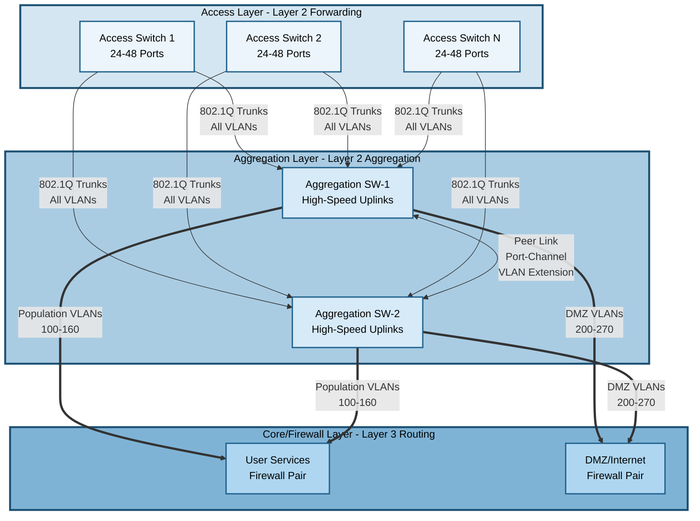

**Access Layer:** Pure Layer 2 forwarding with 802.1Q trunks to aggregation, QoS marking at ingress, RSTP edge ports.

**Aggregation Layer:** Layer 2 aggregation with VLANs extended via peer link, high-bandwidth uplinks to firewalls, active-active forwarding.

**Core/Firewall Layer:** Layer 3 boundary where all VLANs terminate, default gateway for all populations, inter-VLAN routing via security policies.

### Two-Tier Collapsed Model (Small Sites)

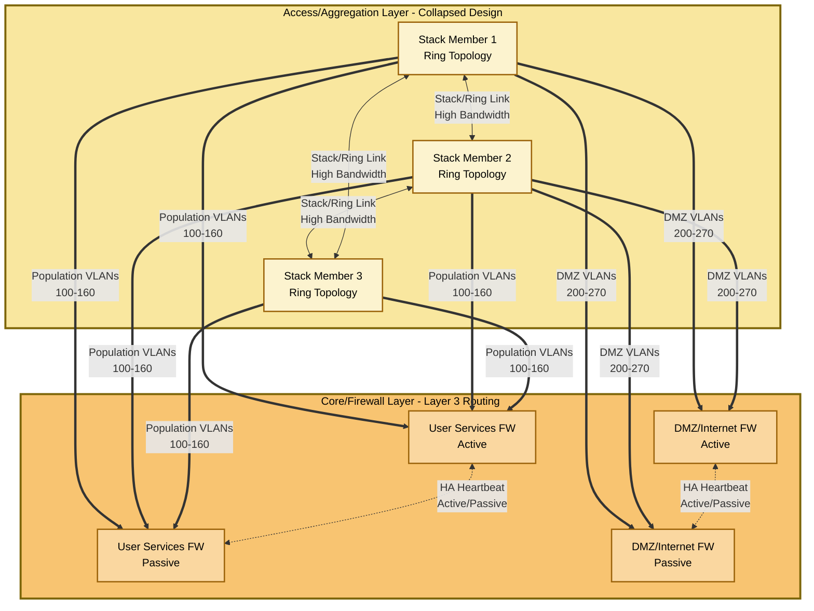

**Access/Aggregation Layer:** Combined functions in stack/ring topology, VLANs extended across all members, automatic failover on member failure.

**Core/Firewall Layer:** Active-passive HA with 3-10 second failover, virtual IP addressing for transparent failover.

### Layer 2/Layer 3 Boundaries

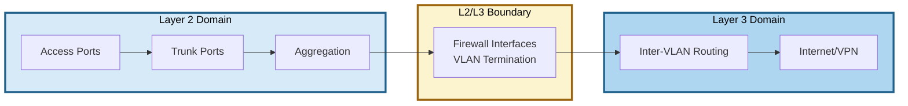

**Layer 2 Domain:** Extends from endpoints through aggregation, VLANs propagate via 802.1Q trunks, RSTP prevents loops.

**Boundary:** Occurs at firewall interfaces using subinterfaces or SVIs, each VLAN receives dedicated firewall interface with gateway IP.

**Layer 3 Domain:** Inter-VLAN routing requires firewall policy, internet and VPN routing, security zones enforce least-privilege.

---

## Firewall Architecture

### Dual Firewall Function Model

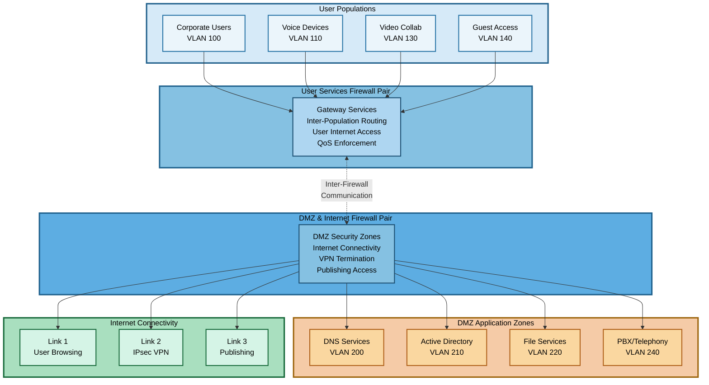

**Function Separation Rationale:**

- **Security Isolation:** User Services firewall isolated from DMZ attack vectors
- **Policy Simplification:** Each firewall maintains focused rule sets
- **Operational Independence:** Upgrades and maintenance don't impact both functions
- **Load Distribution:** Traffic distributes across multiple firewall pairs
- **Scalability:** Each function scales independently

### User Services Firewall

**Primary Functions:**
- Default gateway for all population VLANs
- Inter-population routing with security policy enforcement
- User internet access gateway
- QoS policy enforcement
- NAT translation for user traffic

**High Availability:**
- **Large Sites:** Active-active clustering with hitless failover
- **Small Sites:** Active-passive with 3-10 second failover

**Security Policy Framework:**
- Least-privilege model with default deny
- Explicit permits for business requirements (e.g., Corporate Users to AD DMZ)
- All inter-population traffic blocked unless permitted

### DMZ and Internet Firewall

**Primary Functions:**
- Security zone termination for all DMZ VLANs
- Internet connectivity for all links
- IPsec VPN tunnel termination
- Publishing DMZ access (large sites)
- Inter-DMZ communication enforcement

**Interface Configuration:**
- Dedicated interface per DMZ zone
- Multiple internet link interfaces (browsing, VPN, publishing)
- Inter-firewall link to User Services firewall
- Management interface to Firewall OOB DMZ

**Security Policy Framework:**
- DMZ-to-DMZ default deny with explicit permits
- User-to-DMZ controlled via both firewalls
- DMZ-to-internet requires explicit policies
- Publishing DMZ strict inbound filtering

### High Availability Strategies

**Active-Active (Large Sites):**
- Session distribution via hash algorithm
- Real-time state synchronization
- Hitless failover for existing sessions
- Configuration synchronizes across cluster

**Active-Passive (Small Sites):**
- Health monitoring via heartbeat
- Virtual IP addressing
- Automatic failover on active failure
- 3-10 second failover time
- Non-preemptive failback recommended

---

## Switching Infrastructure Design

### Protocol Standards

**Spanning Tree Protocol: Rapid STP (802.1w)**

- RSTP enabled on all trunk ports
- Edge ports on access ports for immediate forwarding
- BPDU Guard prevents rogue switches
- Root Bridge on aggregation switches
- Sub-second convergence for topology changes

**VLAN Configuration: 802.1Q Trunking**

- All inter-switch links use 802.1Q tagging
- Explicit VLAN allow-lists (never trunk all)
- Native VLAN configured but unused
- Access ports assigned single VLAN

**Quality of Service (QoS)**

- QoS enabled throughout network
- Classification and marking at access port ingress
- Multiple egress queues (minimum 4, preferably 8)
- DSCP/CoS values map to appropriate queues
- Strict priority for voice, weighted fair queuing for data

### Inter-Switch Connectivity

**Link Speed:** Maximum available speed supported by hardware (1G, 10G, 25G, 40G, 100G)

**Access to Aggregation (Large Sites):**
- Each access switch dual-homed to both aggregation switches
- Individual Layer 2 trunks (not EtherChannel)
- RSTP ensures loop-free topology

**Aggregation Peer Link (Large Sites):**
- High-bandwidth link for VLAN extension
- Port-channel with LACP
- Carries all campus VLANs

**Stack/Ring (Small Sites):**
- Dedicated stacking/ring modules
- Ring topology for redundancy
- Any single link failure maintains connectivity

**Switch to Firewall:**
- Separate physical interfaces to each firewall
- No port-channel across firewalls
- VLAN trunks carry population and DMZ VLANs

**Bandwidth Sizing:**
- Access to Aggregation: 20:1 oversubscription typical
- Aggregation to Firewall: 4:1 to 8:1 typical
- 30-50% growth buffer

### Redundancy and Resilience

**Failure Scenarios:**

- **Access Switch Failure:** Users on failed switch lose connectivity, no network reconvergence required
- **Aggregation Switch Failure:** Traffic shifts to surviving switch via RSTP (1-2 seconds)
- **Stack Member Failure:** Ring adjusts, remaining members operational
- **Firewall Uplink Failure:** RSTP redirects to surviving firewall
- **Power Loss:** UPS on critical infrastructure, generator backup for extended outages

---

## Port Configuration Standards by Population Type

This section defines switch port configuration templates for each population type, specifying security features, protocol controls, and operational parameters. All configurations are vendor-neutral and focus on standardized Layer 2 features.

### Configuration Philosophy

**Defense in Depth at the Access Layer:**

Port-level security controls provide the first line of defense against network threats. Each population type receives tailored port configurations matching its security posture, traffic characteristics, and operational requirements. These configurations enforce policy at the network edge, preventing threats before they reach the aggregation or firewall layers.

**Consistent Implementation:**

Port configurations remain consistent across all sites regardless of size. An access port serving Corporate Users at a large site uses identical security features as the same population at a small site. This consistency simplifies troubleshooting, reduces configuration errors, and enables centralized management.

### Port Configuration Framework

Each port configuration template includes:

- **Access VLAN Assignment:** Single VLAN per port based on population type
- **Port Security:** MAC address limitations and violation actions
- **Spanning Tree Controls:** BPDU Guard, Root Guard, edge port configuration
- **Voice VLAN:** Dual VLAN support for IP phones with data devices
- **Protocol Inspection:** ARP inspection, IP source guard, DHCP validation
- **Traffic Control:** Snooping protocols, storm control, rate limiting
- **QoS:** Trust settings and marking policies
- **Power over Ethernet (PoE):** Power allocation for supported devices

---

### Population 1: Corporate Users (VLAN 100)

**Port Profile:** CORP-USER-ACCESS

**Access VLAN Configuration:**
- Access VLAN: 100 (Corporate Users)
- Mode: Access (untagged)
- VLAN Tagging: None (access port strips tags)

**Port Security:**
- MAC Address Learning: Dynamic
- Maximum MAC Addresses: 3 per port
- Violation Action: Restrict (drop packets, log event, no shutdown)
- Aging: Enabled with 24-hour inactivity timer
- Sticky MAC: Disabled (not required for user endpoints)
- Rationale: Allows PC + IP phone + VM/container on PC. Restrict prevents accidental DoS from shutdown.

**Spanning Tree Protocol:**
- PortFast/Edge Port: Enabled (immediate transition to forwarding)
- BPDU Guard: Enabled (disables port if BPDU received)
- Root Guard: Disabled (not applicable on access ports)
- Loop Guard: Disabled (not applicable on access ports)
- Rationale: BPDU Guard prevents rogue switches. PortFast accelerates endpoint connectivity.

**Voice VLAN:**
- Voice VLAN: 110 (Voice Devices)
- Mode: Enabled (dual VLAN on single physical port)
- Voice Device Detection: LLDP-MED, CDP (if supported)
- Priority: Voice traffic marked as CoS 5 (EF/DSCP 46)
- Rationale: IP phone connects to switch, PC connects to phone. Phone uses VLAN 110, PC uses VLAN 100.

**DHCP Security:**
- DHCP Snooping: Enabled
- Trust State: Untrusted (port cannot be DHCP server)
- Rate Limit: 10 packets per second
- DHCP Binding Database: Enabled (stores IP-to-MAC mappings)
- Option 82 Insertion: Disabled on access ports
- Rationale: Prevents rogue DHCP servers, builds binding database for other security features.

**ARP Inspection:**
- Dynamic ARP Inspection (DAI): Enabled
- Trust State: Untrusted
- Validation: Source MAC, Destination MAC, IP addresses
- Rate Limit: 15 packets per second (burst tolerance)
- DHCP Binding Dependency: Uses DHCP snooping binding database
- Rationale: Prevents ARP spoofing attacks using validated IP-MAC bindings.

**IP Source Guard:**
- IP Source Guard: Enabled
- Filtering: IP address and MAC address
- Binding Source: DHCP snooping binding database
- Rationale: Ensures traffic originates from legitimate IP assigned via DHCP, prevents IP spoofing.

**IGMP Snooping:**
- IGMP Snooping: Enabled at VLAN level (not per-port)
- Fast Leave: Disabled (graceful IGMP leave processing)
- Querier: Disabled (performed by Layer 3 device)
- Rationale: Prevents multicast flooding to all ports, optimizes bandwidth usage.

**Storm Control:**
- Broadcast Storm Control: Enabled, threshold 10% of link bandwidth
- Multicast Storm Control: Enabled, threshold 10% of link bandwidth
- Unknown Unicast Storm Control: Enabled, threshold 10% of link bandwidth
- Action: Traffic drop (no port shutdown)
- Rationale: Prevents network storms from impacting other users or infrastructure.

**QoS Configuration:**
- Trust Mode: Untrusted (rewrite incoming CoS/DSCP)
- Default CoS: 0 (Best Effort)
- Default DSCP: 0 (Best Effort)
- Classification: Port-based for general traffic, trust voice VLAN traffic
- Application Remarking: User Services Firewall performs application-aware remarking (AF21 for business apps)
- Rationale: Corporate users cannot set their own priority. Voice traffic from phone trusted.

**Port Speed and Duplex:**
- Speed: Auto-negotiate (supports 10/100/1000 Mbps)
- Duplex: Auto-negotiate (full-duplex expected)
- Rationale: Auto-negotiation accommodates diverse endpoint capabilities.

**Power over Ethernet:**
- PoE: Enabled
- Priority: Low (users can plug/unplug devices without priority)
- Power Allocation: Up to 30W (PoE+ / 802.3at for IP phones)
- Rationale: Powers IP phones and potentially small network devices.

**Additional Features:**
- Port Description: Mandatory (documents physical location and purpose)
- Error Recovery: Auto-recovery after 300 seconds for error-disabled states
- Link Debounce: 100ms to prevent flapping from marginal cables

---

### Population 2: Voice Devices (VLAN 110)

**Port Profile:** VOICE-DEVICE-ACCESS

**Note:** Voice devices typically connect through Corporate User ports using Voice VLAN feature. Dedicated voice-only ports used for standalone voice devices (conference phones without pass-through, analog adapters).

**Access VLAN Configuration:**
- Access VLAN: 110 (Voice Devices)
- Mode: Access (untagged)
- VLAN Tagging: None

**Port Security:**
- MAC Address Learning: Dynamic with sticky option
- Maximum MAC Addresses: 1 per port (single voice device expected)
- Violation Action: Shutdown (strict enforcement)
- Aging: Disabled (voice devices remain connected)
- Sticky MAC: Enabled (learns and saves MAC address)
- Rationale: Voice-only ports should never see multiple MACs. Shutdown on violation indicates security incident.

**Spanning Tree Protocol:**
- PortFast/Edge Port: Enabled
- BPDU Guard: Enabled
- Root Guard: Disabled
- Loop Guard: Disabled
- Rationale: Identical to corporate user configuration.

**Voice VLAN:**
- Voice VLAN: Not applicable (native access VLAN is voice VLAN)
- Rationale: These are dedicated voice-only ports, not dual-purpose.

**Note on Voice VLAN Architecture:**
- VLAN 110 is the voice device population VLAN (Population 2)
- Voice VLAN feature (dual VLAN on single port) is the primary connection method
- 95% of IP phones connect via corporate user ports using Voice VLAN feature
- Dedicated voice-only ports used only for standalone devices (conference phones, analog adapters)


**DHCP Security:**
- DHCP Snooping: Enabled
- Trust State: Untrusted
- Rate Limit: 5 packets per second (voice devices generate less DHCP traffic)
- DHCP Binding Database: Enabled
- Option 82 Insertion: Disabled
- Rationale: Same protection as corporate users, lower rate limit for voice device profile.

**ARP Inspection:**
- Dynamic ARP Inspection: Enabled
- Trust State: Untrusted
- Validation: Source MAC, Destination MAC, IP
- Rate Limit: 10 packets per second
- Rationale: Voice devices generate minimal ARP, prevents spoofing.

**IP Source Guard:**
- IP Source Guard: Enabled
- Filtering: IP and MAC address
- Binding Source: DHCP snooping database
- Rationale: Voice devices have single IP, strict enforcement appropriate.

**IGMP Snooping:**
- IGMP Snooping: Enabled at VLAN level
- Fast Leave: Enabled (voice devices explicitly leave multicast groups)
- Rationale: Voice systems may use multicast for paging or conferencing.

**Storm Control:**
- Broadcast Storm Control: Enabled, threshold 5% (voice devices generate minimal broadcast)
- Multicast Storm Control: Enabled, threshold 15% (multicast for paging/conferencing)
- Unknown Unicast Storm Control: Enabled, threshold 5%
- Action: Traffic drop
- Rationale: Conservative thresholds for voice-only traffic profile.

**QoS Configuration:**
- Trust Mode: Trusted (voice devices mark traffic correctly)
- Trust Boundary: Enabled with device verification (CDP/LLDP)
- CoS Trust: Enabled (trust 802.1p markings from voice device)
- DSCP Trust: Enabled (trust DSCP markings)
- Rationale: Voice devices are managed endpoints that properly mark traffic. Trust reduces switch CPU load.

**Port Speed and Duplex:**
- Speed: Auto-negotiate (100 Mbps typical for IP phones)
- Duplex: Auto-negotiate (full-duplex required)
- Rationale: Voice devices handle negotiation reliably.

**Power over Ethernet:**
- PoE: Enabled
- Priority: High (voice service critical)
- Power Allocation: 15.4W minimum (802.3af), support up to 30W (802.3at) for video phones
- Power Management: Do not shut down on power shortage (voice critical)
- Rationale: Voice devices require reliable power, high priority ensures they remain powered during shortages.

**Additional Features:**
- LLDP: Enabled (device discovery and capabilities exchange)
- LLDP-MED: Enabled (provides voice VLAN info, QoS policies to phones)
- CDP: Enabled if voice devices require (some IP phones use Cisco Discovery Protocol)
- Error Recovery: Auto-recovery after 300 seconds

---

### Population 3: Building Management Systems (VLAN 120)

**Port Profile:** BMS-DEVICE-ACCESS

**Access VLAN Configuration:**
- Access VLAN: 120 (Building Management Systems)
- Mode: Access (untagged)

**Port Security:**
- MAC Address Learning: Dynamic with sticky option
- Maximum MAC Addresses: 2 per port
- Violation Action: Restrict (log but no shutdown, BMS devices critical to building)
- Aging: Disabled
- Sticky MAC: Enabled (BMS devices rarely change)
- Rationale: Some BMS devices present multiple MACs. Restrict prevents outage from unexpected behavior.

**Spanning Tree Protocol:**
- PortFast/Edge Port: Enabled
- BPDU Guard: Enabled
- Root Guard: Disabled
- Loop Guard: Disabled
- Rationale: BMS devices are endpoints, never switches.

**Voice VLAN:**
- Voice VLAN: Disabled
- Rationale: BMS devices do not support voice services.

**DHCP Security:**
- DHCP Snooping: Disabled
- Rationale: Many BMS devices use static IP addressing configured at device level. DHCP snooping would break connectivity. IP Source Guard and DAI also disabled due to static addressing.

**ARP Inspection:**
- Dynamic ARP Inspection: Disabled
- Rationale: Requires DHCP snooping binding database. BMS uses static IPs, must configure static ARP ACLs if DAI required.

**IP Source Guard:**
- IP Source Guard: Disabled
- Rationale: Requires DHCP binding. Static IP configuration bypasses this protection.

**Security Alternative for Static IP Environments:**

Since DHCP snooping disabled (static IPs), implement manual security bindings:

**Static IP-MAC Binding (Per-Port):**
- Configure static IP-to-MAC bindings on each port
- Enables IP Source Guard functionality without DHCP
- Example: `ip source binding 10.1.120.10 mac 00:11:22:33:44:55`

**Static ARP ACLs (VLAN-Wide):**
- Create ARP access lists with permitted IP-MAC pairs
- Apply to VLAN for Dynamic ARP Inspection
- Requires strict asset management and change control

**Recommendation:** Use DHCP with reservations instead of static IPs to enable automated security features.


**IGMP Snooping:**
- IGMP Snooping: Enabled at VLAN level
- Fast Leave: Disabled
- Rationale: BMS systems may use multicast for equipment communication.

**Storm Control:**
- Broadcast Storm Control: Enabled, threshold 5%
- Multicast Storm Control: Enabled, threshold 10%
- Unknown Unicast Storm Control: Enabled, threshold 5%
- Action: Traffic drop
- Rationale: BMS devices generate low traffic, conservative thresholds prevent misbehaving device from impacting network.

**QoS Configuration:**
- Trust Mode: Untrusted
- Default CoS: 1 (Low priority, CS1)
- Default DSCP: 8 (CS1)
- Rationale: BMS traffic deprioritized, cannot impact business operations.

**Rate Limiting:**
- Ingress Rate Limit: 10 Mbps per port
- Egress Rate Limit: 10 Mbps per port
- Rationale: BMS devices typically low bandwidth. Rate limiting prevents camera floods or misbehaving HVAC controllers.

**Port Speed and Duplex:**
- Speed: Auto-negotiate (many BMS devices 10/100 Mbps only)
- Duplex: Auto-negotiate
- Rationale: BMS devices vary widely in capabilities, auto-negotiation required.

**Power over Ethernet:**
- PoE: Enabled
- Priority: Medium
- Power Allocation: Up to 30W (cameras, access control readers)
- Rationale: Many BMS devices (cameras, card readers, sensors) require PoE.

**Additional Features:**
- Port Description: Mandatory (critical for documenting BMS device type and location)
- Error Recovery: Auto-recovery disabled (manual intervention required for security devices)
- Link Flap Detection: Enabled (BMS devices should have stable connections)

---

### Population 4: Video Collaboration (VLAN 130)

**Port Profile:** VIDEO-COLLAB-ACCESS

**Access VLAN Configuration:**
- Access VLAN: 130 (Video Collaboration)
- Mode: Access (untagged)

**Port Security:**
- MAC Address Learning: Dynamic
- Maximum MAC Addresses: 2 per port
- Violation Action: Restrict
- Aging: Enabled, 24-hour inactivity timer
- Sticky MAC: Disabled
- Rationale: Conference room systems may present multiple interfaces (codec and camera). Restrict prevents shutdown from multi-interface devices.

**Spanning Tree Protocol:**
- PortFast/Edge Port: Enabled
- BPDU Guard: Enabled
- Root Guard: Disabled
- Loop Guard: Disabled
- Rationale: Video endpoints never participate in spanning tree.

**Voice VLAN:**
- Voice VLAN: Disabled
- Rationale: Video systems have dedicated VLAN, not dual-purpose ports.

**DHCP Security:**
- DHCP Snooping: Enabled
- Trust State: Untrusted
- Rate Limit: 10 packets per second
- DHCP Binding Database: Enabled
- Rationale: Video systems typically use DHCP, standard protection applies.

**ARP Inspection:**
- Dynamic ARP Inspection: Enabled
- Trust State: Untrusted
- Validation: Source MAC, Destination MAC, IP
- Rate Limit: 15 packets per second
- Rationale: Video traffic generates more ARP than voice, higher rate limit.

**IP Source Guard:**
- IP Source Guard: Enabled
- Filtering: IP and MAC address
- Binding Source: DHCP snooping database
- Rationale: Standard protection for DHCP-assigned devices.

**IGMP Snooping:**
- IGMP Snooping: Enabled at VLAN level
- Fast Leave: Enabled
- Multicast Routing: Aware (video may use multicast for streaming)
- Rationale: Video collaboration may use multicast for content sharing, recording, or multi-site calls.

**Storm Control:**
- Broadcast Storm Control: Enabled, threshold 10%
- Multicast Storm Control: Enabled, threshold 40% (video multicast streams high bandwidth)
- Unknown Unicast Storm Control: Enabled, threshold 10%
- Action: Traffic drop
- Rationale: Higher multicast threshold accommodates video streaming while preventing floods.

**QoS Configuration:**
- Trust Mode: Trusted (managed video systems mark correctly)
- Trust Boundary: Enabled with device verification (LLDP/CDP)
- CoS Trust: Enabled
- DSCP Trust: Enabled
- Rationale: Conference room systems are managed infrastructure that properly marks video (AF41) and audio (EF) traffic.

**Port Speed and Duplex:**
- Speed: Auto-negotiate (1000 Mbps expected)
- Duplex: Auto-negotiate (full-duplex expected)
- Note: IEEE 802.3ab requires auto-negotiation for 1000BASE-T; hard-coding not supported
- Rationale: Video collaboration requires Gigabit for HD/4K video streams. Hard-set prevents negotiation issues.

**Power over Ethernet:**
- PoE: Enabled
- Priority: High (video conferences business-critical)
- Power Allocation: 30W minimum (802.3at), support up to 60W (802.3bt Type 3) for PTZ cameras
- Rationale: Video codecs and cameras require substantial power, high priority ensures service continuity.

**Additional Features:**
- Jumbo Frames: Enabled (MTU 9000) if supported network-wide
- Flow Control: Enabled (802.3x) to handle traffic bursts
- LLDP: Enabled for device capability exchange
- Error Recovery: Auto-recovery after 300 seconds

---

### Population 5: Guest Access (VLAN 140)

**Port Profile:** GUEST-ACCESS

**Access VLAN Configuration:**
- Access VLAN: 140 (Guest Access)
- Mode: Access (untagged)

**Port Security:**
- MAC Address Learning: Dynamic
- Maximum MAC Addresses: 5 per port (multiple guests may use same port)
- Violation Action: Restrict
- Aging: Enabled, 2-hour inactivity timer (short for guest turnover)
- Sticky MAC: Disabled
- Rationale: Guest ports in common areas see high turnover. Higher MAC limit and short aging accommodate guests.

**Spanning Tree Protocol:**
- PortFast/Edge Port: Enabled
- BPDU Guard: Enabled
- Root Guard: Disabled
- Loop Guard: Disabled
- Rationale: Guests should never connect switches, BPDU Guard critical.

**Voice VLAN:**
- Voice VLAN: Disabled
- Rationale: Guest network does not provide voice services.

**DHCP Security:**
- DHCP Snooping: Enabled
- Trust State: Untrusted
- Rate Limit: 15 packets per second (higher for multiple guest devices)
- DHCP Binding Database: Enabled
- Rationale: Guests must use network DHCP, prevents rogue DHCP servers.

**ARP Inspection:**
- Dynamic ARP Inspection: Enabled
- Trust State: Untrusted
- Validation: Source MAC, Destination MAC, IP
- Rate Limit: 20 packets per second (higher for multiple devices)
- Rationale: Prevents guest-to-guest ARP attacks.

**IP Source Guard:**
- IP Source Guard: Enabled
- Filtering: IP address only (not MAC, too restrictive for guests)
- Binding Source: DHCP snooping database
- Rationale: Prevents IP spoofing while accommodating guest device diversity.

**IGMP Snooping:**
- IGMP Snooping: Enabled at VLAN level
- Fast Leave: Disabled
- Rationale: Guests may stream video, IGMP snooping prevents multicast flooding.

**Storm Control:**
- Broadcast Storm Control: Enabled, threshold 5% (strict for untrusted network)
- Multicast Storm Control: Enabled, threshold 10%
- Unknown Unicast Storm Control: Enabled, threshold 5%
- Action: Traffic drop
- Rationale: Strict storm control prevents guest device misbehavior from impacting network.

**QoS Configuration:**
- Trust Mode: Untrusted (guests cannot set priority)
- Default CoS: 1 (Scavenger)
- Default DSCP: 8 (CS1, lowest priority)
- Rate Limiting: May implement per-user rate limiting via other mechanisms
- Rationale: Guest traffic deprioritized below all business traffic.

**Rate Limiting:**
- Ingress Rate Limit: 20 Mbps per port (prevents single guest from consuming bandwidth)
- Egress Rate Limit: 20 Mbps per port
- Rationale: Fair share enforcement, prevents bandwidth hogging.

**Port Speed and Duplex:**
- Speed: Auto-negotiate
- Duplex: Auto-negotiate
- Rationale: Guest devices have wide variety of capabilities.

**Power over Ethernet:**
- PoE: Disabled (guests should not receive network power)
- Rationale: Security consideration, guests do not need PoE.

**Additional Features:**
- Port Description: Documents location (e.g., "Lobby-Guest-01")
- Error Recovery: Auto-recovery after 180 seconds (faster recovery for guest convenience)
- Private VLAN Edge: Enabled if supported (isolates guest ports at Layer 2)
- Rationale: Private VLAN Edge prevents guest-to-guest communication at Layer 2, additional security layer.

---

### Population 6: Administrative Systems (VLAN 150)

**Port Profile:** ADMIN-SYS-ACCESS

**Access VLAN Configuration:**
- Access VLAN: 150 (Administrative Systems)
- Mode: Access (untagged)

**Port Security:**
- MAC Address Learning: Dynamic with sticky option
- Maximum MAC Addresses: 1 per port (dedicated admin workstations)
- Violation Action: Shutdown (strict security enforcement)
- Aging: Disabled
- Sticky MAC: Enabled (admin workstations have known MACs)
- Rationale: Admin ports require strict access control. Shutdown on violation indicates potential security incident requiring investigation.

**Spanning Tree Protocol:**
- PortFast/Edge Port: Enabled
- BPDU Guard: Enabled
- Root Guard: Disabled
- Loop Guard: Disabled
- Rationale: Admin workstations are endpoints only.

**Voice VLAN:**
- Voice VLAN: 110 (if admin staff have IP phones)
- Mode: Enabled
- Rationale: Admin staff may require voice services, dual VLAN configuration.

**DHCP Security:**
- DHCP Snooping: Enabled
- Trust State: Untrusted
- Rate Limit: 10 packets per second
- DHCP Binding Database: Enabled
- Rationale: Admin workstations use DHCP, full security stack applied.

**ARP Inspection:**
- Dynamic ARP Inspection: Enabled
- Trust State: Untrusted
- Validation: Source MAC, Destination MAC, IP
- Rate Limit: 15 packets per second
- Rationale: Admin network requires maximum protection against spoofing.

**IP Source Guard:**
- IP Source Guard: Enabled
- Filtering: IP and MAC address (strict filtering)
- Binding Source: DHCP snooping database
- Rationale: Admin workstations have single IP, strict enforcement appropriate.

**IGMP Snooping:**
- IGMP Snooping: Enabled at VLAN level
- Fast Leave: Disabled
- Rationale: Standard multicast optimization.

**Storm Control:**
- Broadcast Storm Control: Enabled, threshold 5%
- Multicast Storm Control: Enabled, threshold 5%
- Unknown Unicast Storm Control: Enabled, threshold 5%
- Action: Shutdown port (strict enforcement)
- Rationale: Admin workstations should never generate storms. Shutdown indicates compromised device or malware.

**Note:** Shutdown action appropriate for admin systems (indicates compromise). Critical infrastructure (BMS, OT) uses "restrict" to maintain availability while logging violations.

**QoS Configuration:**
- Trust Mode: Untrusted for data traffic, trusted for voice VLAN
- Default CoS: 3 (Medium priority)
- Default DSCP: 26 (AF31)
- Rationale: Admin traffic receives medium priority, above general users but below real-time traffic.

**Port Speed and Duplex:**
- Speed: 1000 Mbps (Gigabit) required
- Duplex: Full-duplex required
- Auto-negotiate: Disabled (hard-set for consistency)
- Rationale: Admin workstations perform management tasks requiring reliable high-bandwidth connectivity.

**Power over Ethernet:**
- PoE: Enabled
- Priority: Medium
- Power Allocation: Up to 30W
- Rationale: Admin staff may have IP phones requiring PoE.

**Additional Features:**
- 802.1X Authentication: Strongly recommended (authenticate admin workstations)
- Port Description: Mandatory with admin username/employee ID
- Error Recovery: Disabled (manual intervention required for security)
- Logging: Enhanced logging for all port events (MAC changes, link up/down, security violations)
- Rationale: Admin ports require audit trail for compliance and security investigations.

---

### Population 7: Operational Technology (VLAN 160)

**Port Profile:** OT-DEVICE-ACCESS

**Access VLAN Configuration:**
- Access VLAN: 160 (Operational Technology)
- Mode: Access (untagged)

**Port Security:**
- MAC Address Learning: Dynamic with sticky option
- Maximum MAC Addresses: 1 per port (industrial devices single-homed)
- Violation Action: Restrict (OT devices critical, avoid shutdown)
- Aging: Disabled
- Sticky MAC: Enabled (OT devices have fixed MACs)
- Rationale: OT devices rarely change. Restrict prevents outage while logging violations for investigation.

**Spanning Tree Protocol:**
- PortFast/Edge Port: Enabled
- BPDU Guard: Enabled (critical - prevents OT network loops)
- Root Guard: Disabled
- Loop Guard: Disabled
- Rationale: OT devices never switches, BPDU Guard prevents unauthorized OT network equipment.

**Voice VLAN:**
- Voice VLAN: Disabled
- Rationale: OT network isolated, no voice services.

**DHCP Security:**
- DHCP Snooping: Disabled
- Rationale: OT devices predominantly use static IP addressing configured at device level for deterministic behavior.

**ARP Inspection:**
- Dynamic ARP Inspection: Disabled
- Rationale: Static IP addressing bypasses DHCP binding database. If DAI required, must configure static ARP ACLs.

**IP Source Guard:**
- IP Source Guard: Disabled
- Rationale: Requires DHCP binding. OT uses static IPs. Alternative: configure static IP-MAC bindings manually.

**IGMP Snooping:**
- IGMP Snooping: Enabled at VLAN level
- Fast Leave: Disabled (OT devices may not send explicit leave)
- Rationale: Some OT protocols use multicast, snooping prevents flooding.

**Storm Control:**
- Broadcast Storm Control: Enabled, threshold 3% (very conservative)
- Multicast Storm Control: Enabled, threshold 5%
- Unknown Unicast Storm Control: Enabled, threshold 3%
- Action: Restrict (drop packets, log, no shutdown - OT devices critical)
- Rationale: OT devices generate minimal traffic, tight thresholds. Restrict prevents outage while alerting to problems.

**QoS Configuration:**
- Trust Mode: Untrusted for standard OT, Trusted for critical control loops
- Default CoS: 3 (Medium-high for standard), 5 (High for critical control)
- Default DSCP: 28 (AF32 for standard), 46 (EF for critical control loops)
- Rationale: OT traffic prioritized to ensure deterministic behavior. Critical safety systems receive highest priority.

**Port Speed and Duplex:**
- Speed: Hard-set based on device capabilities (often 100 Mbps for industrial equipment)
- Duplex: Full-duplex preferred, half-duplex supported if required
- Auto-negotiate: Disabled (deterministic behavior required)
- Rationale: Industrial equipment may not handle auto-negotiation reliably. Hard-set ensures consistent performance.

**Power over Ethernet:**
- PoE: Enabled where required (sensors, small controllers)
- Priority: High (OT devices critical to operations)
- Power Allocation: Based on device requirements (15W-30W typical)
- Rationale: OT devices require reliable power, high priority ensures uptime.

**Additional Features:**
- Port Description: Mandatory (documents OT device type, asset tag, criticality)
- Error Recovery: Disabled (manual intervention required for OT network changes)
- Change Control: All port configuration changes require formal change approval
- Link Flap Detection: Enabled (OT devices should have extremely stable connections)
- Unidirectional Link Detection (UDLD): Enabled (prevents one-way link issues in critical control)
- Rationale: OT network requires maximum stability and change control for safety and availability.

---

### Trunk Port Configuration

**Trunk Profile:** INTER-SWITCH-TRUNK

Trunk ports connect switches to each other (access to aggregation, aggregation to aggregation, aggregation to firewall).

**VLAN Configuration:**
- Mode: Trunk (tagged for all VLANs)
- Allowed VLANs: Explicit list (never "all")
- Native VLAN: 999 (unused VLAN, security best practice)
- Rationale: Explicit VLAN list prevents VLAN leakage. Unused native VLAN prevents VLAN hopping attacks.

**Port Security:**
- Port Security: Disabled on trunks
- Rationale: Trunk ports carry traffic for multiple VLANs and MAC addresses, port security not applicable.

**Spanning Tree Protocol:**
- PortFast/Edge Port: Disabled (trunks participate in STP)
- BPDU Guard: Disabled (trunks must send/receive BPDUs)
- BPDU Filter: Disabled
- Root Guard: Enabled on access-to-aggregation uplinks (prevents access switch from becoming root)
- Loop Guard: Enabled (detects unidirectional link failures)
- Rationale: Root Guard ensures aggregation layer remains STP root. Loop Guard prevents loops from unidirectional failures.

**DHCP Security:**
- DHCP Snooping: Enabled
- Trust State: **Varies by trunk type**
  - Access-to-Aggregation trunks: **UNTRUSTED** (carry only client requests)
  - Aggregation-to-Firewall trunks: **TRUSTED** (carry DHCP server responses from DMZ)
- Rationale: Only trunks carrying DMZ VLAN traffic (where DHCP servers reside) should be trusted

**ARP Inspection:**
- Dynamic ARP Inspection: Enabled (passthrough mode)
- Trust State: Trusted (uplink trunks trusted)
- Rate Limit: None (full bandwidth for legitimate traffic)
- Rationale: Uplink trunks carry legitimate ARP traffic from all VLANs.

**IP Source Guard:**
- IP Source Guard: Disabled on trunks
- Rationale: Not applicable to trunk ports carrying multiple source IPs.

**Storm Control:**
- Broadcast Storm Control: Enabled, threshold 20% (higher than access ports)
- Multicast Storm Control: Enabled, threshold 30%
- Unknown Unicast Storm Control: Enabled, threshold 20%
- Action: Traffic drop (never shutdown trunk)
- Rationale: Higher thresholds accommodate aggregate traffic from multiple access ports. Drop never shuts down critical trunk.

**QoS Configuration:**
- Trust Mode: Trusted (preserve CoS/DSCP markings across trunks)
- CoS Trust: Enabled
- DSCP Trust: Enabled
- Rationale: QoS markings applied at access layer must propagate through network.

**Port Speed and Duplex:**
- Speed: Maximum supported (10G, 25G, 40G, 100G)
- Duplex: Full-duplex required
- Auto-negotiate: Enabled for copper, disabled for fiber
- Rationale: Trunk links require maximum bandwidth, full-duplex mandatory for performance.

**Link Aggregation:**
- Port Channel: Enabled where applicable (aggregation peer link)
- Protocol: LACP (802.3ad)
- Mode: Active (initiates negotiation)
- Rationale: LACP provides dynamic link aggregation with failover.

**Additional Features:**
- Jumbo Frames: Enabled (MTU 9000) if supported end-to-end
- Flow Control: Disabled (can cause head-of-line blocking)
- UDLD: Enabled (detects unidirectional links)
- Error Recovery: Auto-recovery after 300 seconds for non-critical trunks, disabled for critical trunks

---

### Configuration Management

**Template Deployment:**

Port configurations deployed via centralized management system using templates:
- Template per population type stored in configuration management system
- Bulk deployment to switches based on port-to-population mappings
- Configuration auditing ensures compliance with templates

**Change Control:**

All port configuration changes follow formal change management:
- Admin Systems and OT ports require higher approval authority
- Emergency changes documented and reviewed post-implementation
- Configuration backup before and after all changes

**Monitoring and Alerting:**

Port security events generate alerts and logging:
- MAC address violations logged to SIEM
- BPDU Guard violations generate immediate high-priority alerts
- Storm control events trigger investigation
- Port flapping (multiple up/down events) generates alerts
- Error-disabled ports require investigation before re-enable

**Documentation:**

Every port maintains documentation:
- Port description field populated with device, location, purpose
- Asset management system links physical device to logical port
- Network diagrams updated to reflect port assignments
- Population type clearly identified in documentation

---

### Port Configuration Summary Table

| Feature | Corporate | Voice | BMS | Video | Guest | Admin | OT |
|---------|-----------|-------|-----|-------|-------|-------|----|
| **VLAN** | 100 | 110 | 120 | 130 | 140 | 150 | 160 |
| **Max MACs** | 3 | 1 | 2 | 2 | 5 | 1 | 1 |
| **Violation Action** | Restrict | Shutdown | Restrict | Restrict | Restrict | Shutdown | Restrict |
| **Sticky MAC** | No | Yes | Yes | No | No | Yes | Yes |
| **PortFast** | Yes | Yes | Yes | Yes | Yes | Yes | Yes |
| **BPDU Guard** | Yes | Yes | Yes | Yes | Yes | Yes | Yes |
| **Voice VLAN** | 110 | N/A | No | No | No | 110 | No |
| **DHCP Snooping** | Yes | Yes | No | Yes | Yes | Yes | No |
| **DAI** | Yes | Yes | No | Yes | Yes | Yes | No |
| **IP Source Guard** | Yes | Yes | No | Yes | Yes | Yes | No |
| **Storm Control** | 10% | 5% | 5% | 10%/40% | 5% | 5% | 3% |
| **QoS Trust** | Untrusted | Trusted | Untrusted | Trusted | Untrusted | Untrusted | Mixed |
| **Default DSCP** | 0 | EF (46) | 8 (CS1) | AF41 (34) | 8 (CS1) | 26 (AF31) | 28 (AF32) |
| **Rate Limit** | None | None | 10 Mbps | None | 20 Mbps | None | None |
| **Speed** | Auto | Auto | Auto | 1G fixed | Auto | 1G fixed | Fixed |
| **PoE** | Enabled | Enabled | Enabled | Enabled | Disabled | Enabled | Mixed |
| **PoE Priority** | Low | High | Medium | High | N/A | Medium | High |

---

## Population Types and Network Segmentation

### Population Definitions

#### Population 1: Corporate Users (CORP-USERS)

**VLAN:** 100

**Description:** Standard office workers requiring full access to corporate applications and internet.

**Estimated Population:**
- Large Sites: 500-2000 users
- Small Sites: 50-400 users

**Traffic Characteristics:**
- Web browsing, email, file transfers, video conferencing
- Average: 2-5 Mbps sustained, 10-20 Mbps burst
- Bursty traffic, peaks during business hours

**QoS Requirements:**
- Priority: Standard
- DSCP: AF21 for business apps, CS0 for general
- Queue: Default with fair-share scheduling

**Security Requirements:**
- Full internet access via filtering
- Access to most DMZ services (DNS, AD, file shares)
- Restricted from guest, OT, BMS networks
- User authentication required

#### Population 2: Voice Devices (VOICE)

**VLAN:** 110

**Description:** IP telephony endpoints requiring strict QoS and low latency.

**Estimated Population:**
- Large Sites: 300-1000 devices
- Small Sites: 40-300 devices

**Traffic Characteristics:**
- SIP signaling, RTP/RTCP media
- Low bandwidth: 64-128 kbps per call
- Latency sensitive: <150ms required
- Jitter sensitive: <30ms required

**QoS Requirements:**
- Priority: Highest (Critical)
- DSCP: EF for media, CS3 for signaling
- Queue: Strict priority, 15-20% bandwidth reservation

**Security Requirements:**
- Access to PBX DMZ only
- Isolated from user populations
- Voice VLAN security prevents data device attachment

#### Population 3: Building Management Systems (BMS)

**VLAN:** 120

**Description:** IoT and industrial devices controlling HVAC, lighting, access control, cameras.

**Estimated Population:**
- Large Sites: 100-500 devices
- Small Sites: 30-150 devices

**Traffic Characteristics:**
- BACnet, Modbus, HTTPS, RTSP
- Low bandwidth: 512 kbps - 2 Mbps
- Always-on with periodic bursts

**QoS Requirements:**
- Priority: Low (Below Default)
- DSCP: CS1
- Queue: Low-priority, 5-10% guarantee
- May implement rate-limiting

**Security Requirements:**
- No internet access (default deny)
- Highly restricted inter-population communication
- Isolated from corporate and other populations
- Vendor access via jump host only

#### Population 4: Video Collaboration (VIDEO-COLLAB)

**VLAN:** 130

**Description:** Conference room codecs, digital whiteboards, telepresence endpoints.

**Estimated Population:**
- Large Sites: 50-200 devices
- Small Sites: 10-50 devices

**Traffic Characteristics:**
- H.264/H.265 video codecs
- SIP/H.323 signaling
- High bandwidth: 2-8 Mbps per session
- Latency sensitive: <150ms
- Bursty when active

**QoS Requirements:**
- Priority: High (Critical)
- DSCP: AF41 for video, EF for audio
- Queue: High-priority, 20-30% reservation

**Security Requirements:**
- Limited internet access (collaboration providers only)
- Access to collaboration DMZ
- Isolated from general corporate network
- Encrypted media streams (SRTP)

#### Population 5: Guest Access (GUEST)

**VLAN:** 140

**Description:** Visitors requiring basic internet without corporate access.

**Estimated Population:**
- Large Sites: 50-300 concurrent
- Small Sites: 10-100 concurrent

**Traffic Characteristics:**
- Web browsing, email, video streaming
- Unpredictable patterns
- Average: 5-10 Mbps per user

**QoS Requirements:**
- Priority: Lowest (Scavenger)
- DSCP: CS0 or CS1
- Queue: Lowest priority, no guarantee
- Per-user rate limiting (10-20 Mbps cap)

**Security Requirements:**
- Internet access only
- Access to DNS DMZ only
- Captive portal authentication
- Complete isolation from all other populations
- Session timeout enforced

#### Population 6: Administrative Systems (ADMIN-SYS)

**VLAN:** 150

**Description:** IT administrator workstations, PAWs, network management stations.

**Estimated Population:**
- Large Sites: 20-80 devices
- Small Sites: 5-20 devices

**Traffic Characteristics:**
- Management protocols: SSH, RDP, HTTPS
- Monitoring: SNMP, NetFlow, syslog
- Low to moderate: 1-5 Mbps sustained

**QoS Requirements:**
- Priority: Medium
- DSCP: AF31
- Queue: Medium-priority

**Security Requirements:**
- Restricted internet via proxy
- Full access to management DMZ zones
- Multi-factor authentication required
- Enhanced logging and monitoring
- Jump host usage enforced

#### Population 7: Operational Technology (OT-DEVICES)

**VLAN:** 160

**Description:** Manufacturing, ICS, SCADA, process automation.

**Estimated Population:**
- Large Sites: 100-1000 devices
- Small Sites: 20-200 devices

**Traffic Characteristics:**
- Modbus TCP, Ethernet/IP, Profinet, OPC UA
- Low bandwidth: 100-500 kbps per device
- Deterministic patterns
- Real-time control loops

**QoS Requirements:**
- Priority: Medium-High
- DSCP: AF32 for standard, EF for critical control
- Queue: Dedicated OT queue, 10-20% reservation
- Latency sensitive: <100ms for control

**Security Requirements:**
- No internet access (air-gapped preferred)
- Isolated from all other populations
- Unidirectional gateways for data export
- No inbound connections from other networks
- Industrial firewall or diode between OT and IT

### VLAN Strategy

**One VLAN per Population Type:**

Each population receives exactly one dedicated VLAN (1:1 mapping):

- **Security Isolation:** Populations cannot communicate at Layer 2
- **Policy Clarity:** VLAN ID identifies population type
- **QoS Application:** VLAN drives QoS policy
- **Operational Simplicity:** No VLAN overlap

**VLAN Extension:** All population VLANs (100-160) extend throughout each site. DMZ VLANs (200-270) exist only on aggregation-to-firewall links for mobility and consistent experience.

### QoS Framework

**End-to-End QoS Policy:**

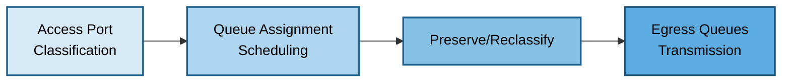

**QoS Marking Standards:**

| Priority | DSCP | DSCP Name | CoS | Population |
|----------|------|-----------|-----|------------|
| Critical | EF (46) | Expedited Forwarding | 5 | Voice Media |
| High | AF41 (34) | Assured Forwarding 4-1 | 4 | Video |
| High | CS3 (24) | Class Selector 3 | 3 | Voice Signaling |
| Medium-High | AF32 (28) | AF 3-2 | 3 | OT Critical |
| Medium | AF31 (26) | AF 3-1 | 3 | Admin |
| Standard | AF21 (18) | AF 2-1 | 2 | Corporate Business |
| Standard | CS0 (0) | Best Effort | 0 | General |
| Low | CS1 (8) | Class Selector 1 | 1 | BMS, Guest |

**8-Queue Model:**
1. Voice (EF) - 15% bandwidth, strict priority
2. Video (AF41) - 25% bandwidth, strict priority
3. Voice signaling (CS3) - 5% bandwidth, WFQ
4. OT critical (AF32) - 10% bandwidth, WFQ
5. Admin (AF31) - 10% bandwidth, WFQ
6. Business (AF21) - 20% bandwidth, WFQ
7. Best effort (CS0) - 10% bandwidth, WFQ
8. Scavenger (CS1) - 5% bandwidth, WFQ

### Security Segmentation Philosophy

**Least-Privilege Access Model:**

Default deny between all populations with explicit permits only when business requirement exists.

**Permitted Examples:**
- Corporate Users to DNS, AD, File DMZs
- Voice Devices to PBX DMZ
- Admin Systems to all Management DMZs

**Denied Examples:**
- Guest to any internal population or DMZ (except DNS)
- BMS to Corporate Users
- OT to any population
- Corporate Users to BMS or OT

---

## DMZ Architecture

### Application DMZ Zones

#### DNS Services DMZ (DMZ-DNS)

**VLAN:** 200  
**Subnet:** /28

**Purpose:** Internal DNS resolvers providing name resolution for all populations.

**Hosted Services:**
- Internal DNS recursive resolvers
- Authoritative DNS for corporate domain
- DNS forwarders to external DNS

**Required Access:**
- Inbound: All populations to UDP/53, TCP/53
- Outbound: DNS to internet for recursive queries
- Outbound: DNS to AD DMZ for integrated zones

**High Availability:** Minimum two DNS servers with anycast or round-robin.

#### Active Directory DMZ (DMZ-AD)

**VLAN:** 210  
**Subnet:** /28 to /27

**Purpose:** AD domain controllers for authentication and directory services.

**Hosted Services:**
- Active Directory domain controllers
- LDAP/LDAPS
- Kerberos authentication
- Group Policy
- NTP

**Required Access:**
- Inbound: Corporate, Admin to TCP/389, 636 (LDAP/LDAPS)
- Inbound: Corporate, Admin to TCP/88, UDP/88 (Kerberos)
- Inbound: Corporate, Admin to TCP/445 (SMB)
- Outbound: AD to DNS DMZ
- Outbound: AD to internet for Azure AD sync

**High Availability:** Minimum two domain controllers with multi-master replication.

#### File Services DMZ (DMZ-FILE)

**VLAN:** 220  
**Subnet:** /27 to /26

**Purpose:** Shared file storage for corporate users.

**Hosted Services:**
- Windows file servers (SMB/CIFS)
- NFS file servers (optional)
- DFS namespace servers

**Required Access:**
- Inbound: Corporate Users to TCP/445, 139 (SMB)
- Outbound: File servers to AD DMZ for authentication
- Outbound: File servers to DNS DMZ

**High Availability:** Clustered file servers, DFS replication.

#### Collaboration Services DMZ (DMZ-COLLAB)

**VLAN:** 230  
**Subnet:** /27 to /25

**Purpose:** Video conferencing and unified communications.

**Hosted Services:**
- Video conferencing MCU
- Collaboration platform servers
- Scheduling services
- Presence/IM

**Required Access:**
- Inbound: Corporate Users to HTTPS (TCP/443)
- Inbound: Video population to SIP, RTP/RTCP
- Outbound: To internet for external participants
- Outbound: To AD DMZ for authentication

**High Availability:** Clustered conferencing servers.

#### PBX and Telephony DMZ (DMZ-PBX)

**VLAN:** 240  
**Subnet:** /27 to /26

**Purpose:** IP-PBX and telephony infrastructure.

**Hosted Services:**
- IP-PBX servers
- Voicemail servers
- Call recording
- SIP proxy/registrar

**Required Access:**
- Inbound: Voice population to SIP, RTP/RTCP
- Inbound: Corporate to HTTPS for voicemail
- Outbound: To AD DMZ for directory
- Outbound: To DNS DMZ

**High Availability:** Redundant PBX with call state synchronization.

### Management DMZ Zones

#### Switch OOB DMZ (DMZ-SW-OOB)

**VLAN:** 250  
**Subnet:** /24 to /22

**Purpose:** Out-of-band management for switch infrastructure.

**Hosted Services:**
- Jump/bastion hosts for SSH access
- Configuration management servers
- TACACS+ authentication
- Syslog collectors
- SNMP monitoring

**Network Architecture:**
- Physically separate OOB switching infrastructure
- Production switch management interfaces connect to OOB switches
- Management interfaces don't carry production traffic

**Required Access:**
- Inbound: Admin Systems to jump hosts
- Inbound: Jump hosts to switch management interfaces (SSH, HTTPS)
- Outbound: TACACS+, syslog, SNMP

**Security:**
- Multi-factor authentication on jump hosts
- Privileged session recording
- Role-based access control
- No direct internet access

#### Firewall OOB DMZ (DMZ-FW-OOB)

**VLAN:** 260  
**Subnet:** /27

**Purpose:** Out-of-band management for firewalls.

**Hosted Services:**
- Jump/bastion hosts for firewall administration
- Firewall configuration management
- Firewall log collectors
- Monitoring platforms

**Network Architecture:**
- Separate from Switch OOB DMZ
- Dedicated management interfaces on firewalls
- Management network doesn't route through production firewalls

**Required Access:**
- Inbound: Admin Systems to jump hosts
- Inbound: Jump hosts to firewall management (SSH, HTTPS)
- Outbound: Syslog, monitoring

**Security:**
- Separate jump hosts from Switch OOB
- Multi-factor authentication mandatory
- Change control for firewall changes
- Configuration backup and version control

### Publishing DMZ (Large Sites)

**VLAN:** 270  
**Subnet:** /26 to /25

**Purpose:** Public-facing services accessible from internet (large sites only).

**Hosted Services:**
- Public web servers
- Email relay (inbound SMTP)
- VPN gateway for remote access
- External APIs
- Reverse proxy/load balancers

**Network Architecture:**
- Dedicated publishing internet link (Link 3)
- Connects to DMZ/Internet firewall inside interface
- No direct communication with internal populations
- May access limited DMZs (DNS, AD for auth)

**Required Access:**
- Inbound: Internet to web (TCP/443, 80)
- Inbound: Internet to email (TCP/25)
- Inbound: Internet to VPN (UDP/443, TCP/443)
- Outbound: To DNS, AD DMZs

**Security:**
- Highest risk due to internet exposure
- Web application firewall (WAF)
- DDoS mitigation
- IPS/IDS inspection
- Regular vulnerability scanning
- Fully hardened servers

### DMZ Security Posture

**Zero Trust Between DMZs:**

- Default deny policy between all DMZ zones
- Explicit permits only with minimal scope
- All permit rules logged for audit

**Internet Access for DMZs:**
- DNS DMZ: Recursive queries (UDP/53, TCP/53)
- AD DMZ: Azure sync, updates (TCP/443, 80)
- Collaboration DMZ: External participants
- Publishing DMZ: Inbound and outbound per service

**User Access to DMZs:**
- Corporate: DNS, AD, File, Collaboration DMZs
- Voice: DNS, PBX DMZ only
- Video: DNS, Collaboration DMZ only
- Admin: All DMZs
- Guest: DNS only
- BMS/OT: None

**Monitoring:**
- All DMZ traffic logged at firewall
- SIEM ingestion and correlation
- Anomaly detection
- Automated alerting

---

## Internet Connectivity Strategy

### Small Site Internet Architecture

**Internet Link 1: User Browsing**

- Primary internet for all user populations
- Web browsing, SaaS, email
- Bandwidth: 100 Mbps - 1 Gbps
- NAT, URL filtering, IPS/IDS
- Connects to DMZ/Internet firewall

**Internet Link 2: IPsec VPN**

- Dedicated for site-to-site VPN tunnels
- Isolates VPN from user browsing
- Bandwidth: 50 Mbps - 500 Mbps
- Site operates as VPN spoke
- Connects to DMZ/Internet firewall

**Redundancy:**
- Link 1 failure → User traffic fails to Link 2 (5-30 seconds)
- Link 2 failure → VPN disconnects, site isolated from other sites
- Both failure → Complete internet loss

### Large Site Internet Architecture

**Internet Link 1: User Browsing**

- Scaled for large user population
- Bandwidth: 500 Mbps - 10 Gbps
- Otherwise identical to small site Link 1

**Internet Link 2: IPsec VPN**

- Enhanced for hub role
- Terminates tunnels from all spoke sites
- Routes spoke-to-spoke traffic
- Bandwidth: 1 Gbps - 10 Gbps

**Internet Link 3: Publishing Services**

- Dedicated for public-facing services
- Publishing DMZ isolation from internal networks
- Bandwidth: 100 Mbps - 1 Gbps
- DDoS mitigation from provider
- Multiple public IPs
- WAF inspection, IPS/IDS
- Reverse proxy for TLS offload

**Redundancy:**
- Link 1 failure → User traffic to Link 2
- Link 2 failure → VPN attempts Link 1 or alternate hub
- Link 3 failure → DNS failover to secondary publishing site

### Routing Policy Framework

**Link Selection Logic:**

Small Sites:
- Link 1: All user and DMZ traffic (default route)
- Link 2: VPN tunnels exclusively (policy routing)
- Failover: Link 1 down → traffic to Link 2

Large Sites:
- Link 1: User and DMZ traffic (default route)
- Link 2: VPN tunnels (isolated via policy routing)
- Link 3: Publishing DMZ traffic (dedicated routing)
- Failover: Automatic redistribution to available links

**Routing Protocols:**
- Static routing acceptable for small sites
- BGP preferred for large sites with multiple links
- Policy-based routing for source-based selection
- Route metrics control link preference

---

## Inter-Site VPN Connectivity

### Point-to-Multipoint IPsec Architecture

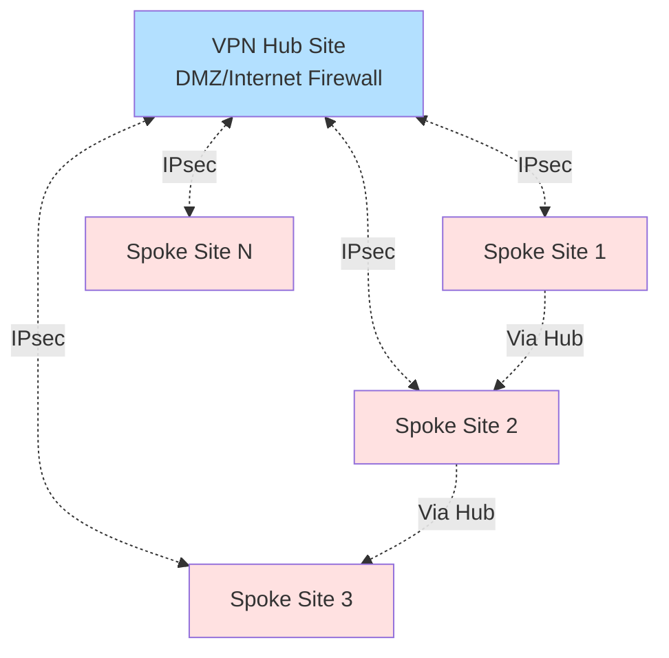

**Hub and Spoke Topology:**

- Hub sites terminate VPN tunnels from all spokes
- Spoke-to-spoke traffic transits hub
- Fewer tunnels than full mesh (N vs N×(N-1)/2)
- Centralized policy enforcement

**Dual Hub Design:**
- Primary hub for normal operations
- Secondary hub for redundancy
- Spokes establish tunnels to both hubs
- Automatic failover on primary hub failure (30-60 seconds)

### VPN Routing Strategy

**IPsec Tunnel Specifications:**

- Protocol: IKEv2 (IKEv1 compatible)
- Phase 1 Encryption: AES-256
- Phase 1 Integrity: SHA-256
- Phase 1 DH Group: Group 19 (ECC) or Group 14
- Phase 1 Lifetime: 28,800 seconds (8 hours)
- Phase 2 Encryption: AES-256-GCM
- Phase 2 PFS: Enabled (Group 19/14)
- Phase 2 Lifetime: 3,600 seconds (1 hour)
- DPD: 10 second interval, 3 retries
- NAT-Traversal: Enabled (UDP 4500)

**Dynamic Routing: BGP Over IPsec**

The network uses BGP as the dynamic routing protocol for VPN overlay, providing automatic route propagation, fast convergence, and policy-based routing control.

**BGP Architecture Overview:**

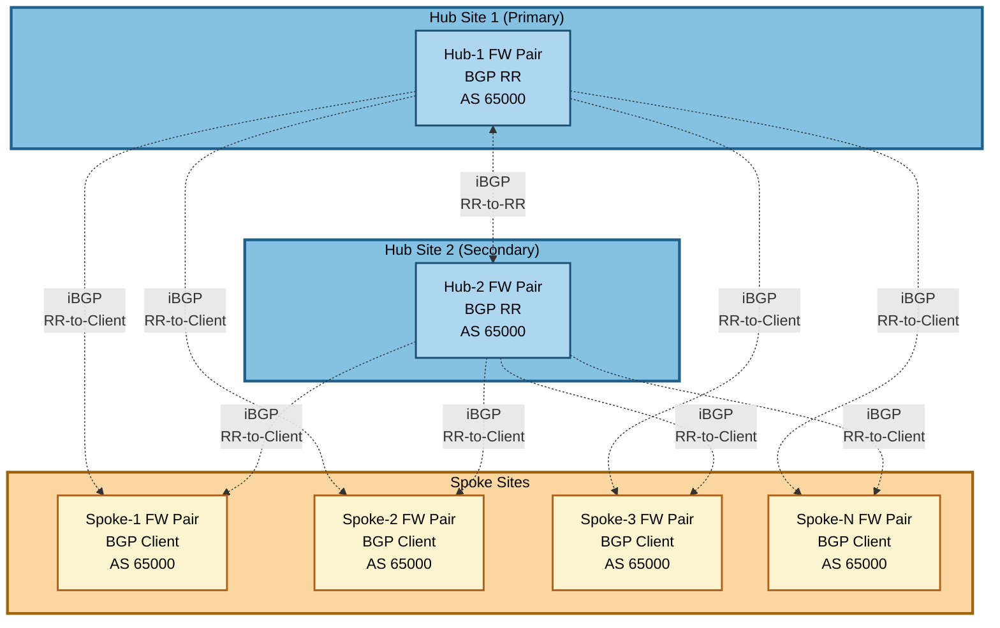

**BGP Configuration Principles:**

**Autonomous System (AS) Number:**
- Single private AS for entire enterprise: AS 65000 (example, within 64512-65534 range)
- All sites use same AS number (iBGP deployment)
- Alternative: Use public AS if enterprise has registered AS number

**Hub Sites as Route Reflectors:**
- Large hub sites configured as BGP Route Reflectors (RR)
- Route Reflectors eliminate full mesh iBGP requirement
- Hub RRs peer with each other (RR-to-RR session)
- Hub RRs peer with all spoke sites (RR-to-client sessions)
- Spokes do not peer with each other, only with hub RRs

**BGP Session Establishment:**

**Hub-to-Hub (RR-to-RR):**
- iBGP session between hub firewall pairs
- Session established over IPsec VPN tunnel between hubs
- BGP neighbor: Loopback IP addresses of hub firewalls
- Update-source: Loopback interface for session stability
- Next-hop-self: Enabled to ensure reachability
- Purpose: Synchronize routing information between hub RRs

**Hub-to-Spoke (RR-to-Client):**
- iBGP session from spoke to both hub RRs
- Session established over IPsec VPN tunnels (spoke-to-hub1, spoke-to-hub2)
- BGP neighbor: Loopback IP of hub RR firewalls
- Update-source: Spoke loopback interface
- Route-reflector-client: Configured on hub for spoke sessions
- Purpose: Hub advertises all enterprise routes to spokes, spoke advertises local routes to hubs

**Loopback Interfaces:**
- Each firewall pair configured with loopback interface
- Loopback IP address: Single IP per site (e.g., 192.168.255.1/32 for Hub-1)
- Loopback IP advertised into BGP as /32 host route
- BGP sessions source from loopback for stability (tunnel IP changes don't affect BGP)
- Loopback IP remains reachable as long as any VPN tunnel active

**Route Advertisement:**

**Hub Route Reflector Behavior:**
- Receives routes from spoke clients and other RR
- Reflects routes learned from one spoke to all other spokes
- Advertises hub local networks (DMZ subnets, population subnets)
- Preserves AS-path when reflecting but sets next-hop to self for proper hub-spoke routing
- Sets next-hop to self for all reflected routes (standard RR behavior in hub-spoke VPN)

**Spoke BGP Behavior:**
- Advertises local site networks (population VLANs, local DMZ VLANs)
- Receives all enterprise routes from hub RR
- Installs best path in routing table (prefers primary hub, fails to secondary hub)
- Does not re-advertise routes learned from hub (client behavior)

**BGP Attributes and Path Selection:**

**Local Preference (Primary/Secondary Hub Selection):**
- Spokes set higher local preference for routes learned from primary hub: 150
- Routes from secondary hub receive default local preference: 100
- Higher local preference preferred, ensures primary hub used when both available
- Upon primary hub failure, secondary hub routes become best path automatically

**AS-Path Prepending (Optional):**
- Not typically used in iBGP route reflector design
- All sites in same AS, AS-path does not grow
- Route Reflector does not prepend AS number when reflecting

**MED (Multi-Exit Discriminator):**
- Not used in typical hub-spoke design
- Could be used to influence inbound traffic path if multiple hubs with asymmetric bandwidth

**BGP Timers:**
- Keepalive: 60 seconds (default)
- Hold time: 180 seconds (default)
- Provides balance between fast failure detection and BGP session stability
- Shorter timers possible for faster convergence (e.g., 10s keepalive, 30s hold) but increases BGP overhead

**BGP Convergence and Failover:**

**Primary Hub Failure Scenario:**
1. Spoke detects IPsec tunnel failure to primary hub (DPD triggers within 30 seconds)
2. BGP session to primary hub RR times out (hold timer: 180 seconds) or tears down immediately if tunnel fails
3. Spoke withdraws primary hub routes from routing table
4. Secondary hub routes (lower local preference) now become best path
5. Spoke installs secondary hub routes into routing table
6. Traffic begins routing through secondary hub
7. Convergence time: ~30-60 seconds (tunnel detection + BGP convergence)

**Spoke Site Failure:**
1. Hub RR detects IPsec tunnel failure to spoke
2. BGP session to spoke times out or tears down
3. Hub RR withdraws spoke routes from BGP
4. Hub RR reflects withdrawal to other spokes and other RR
5. Enterprise stops routing traffic to failed spoke
6. Convergence time: ~30-60 seconds

**Inter-Firewall HA and BGP:**

**Active-Active Firewall Clusters (Large Sites):**
- Firewall pair shares single loopback IP (cluster virtual IP)
- BGP session established using cluster loopback IP
- Both firewall members participate in routing but present as single BGP speaker
- Session state synchronizes between cluster members
- Failover transparent to BGP peers (no session disruption)
- Recommendation: Use cluster IP for BGP, ensures hitless failover

**Active-Passive Firewall Pairs (Small Sites):**
- Loopback IP configured as virtual IP (floating between active/passive)
- Only active firewall establishes and maintains BGP sessions using loopback IP
- Passive firewall does NOT establish BGP sessions (remains idle for BGP)
- Configuration synchronized from active to passive for consistency
- Upon failover:
  1. Passive firewall detects active failure via heartbeat
  2. Passive assumes active role and claims loopback IP (virtual IP takeover)
  3. New active firewall initiates BGP sessions to hub RRs
  4. BGP sessions establish from new active firewall (new TCP connections)
  5. Hub RRs detect previous session failure (hold timer expiration ~180 seconds)
  6. New BGP sessions establish, routes exchanged
  7. Full convergence time: 3-5 minutes (heartbeat detection + BGP session establishment + route exchange)
- Note: BGP graceful restart has limited effectiveness in active-passive IPsec scenarios due to tunnel failure during failover
- Note: Existing traffic may be disrupted during failover window, applications should retry connections

**Inter-Firewall Routing (User Services ↔ DMZ/Internet Firewalls):**

Within each site, User Services firewall and DMZ/Internet firewall exchange routes:

**BGP Peering Between Firewall Pairs:**
- iBGP session between User Services FW pair and DMZ/Internet FW pair
- Session established over inter-firewall link (dedicated VLAN or point-to-point link)
- BGP neighbor: Directly connected IP addresses on inter-firewall link
- Purpose: User Services FW learns DMZ routes, DMZ/Internet FW learns population routes

**Route Exchange:**
- User Services FW advertises population VLANs (100-160) to DMZ/Internet FW
- DMZ/Internet FW advertises DMZ VLANs (200-270) and default route (0.0.0.0/0) to User Services FW
- DMZ/Internet FW advertises VPN-learned remote site routes to User Services FW
- Enables user populations to reach DMZs and remote sites via User Services FW default gateway

**Next-Hop Behavior:**
- Next-hop-self configured on both firewalls for routes advertised to each other
- Ensures traffic routes correctly through inter-firewall link
- Example: User on VLAN 100 accesses DNS DMZ (VLAN 200)
  1. User gateway: User Services FW (learned via VLAN 100 default gateway)
  2. User Services FW routes to DMZ/Internet FW via BGP route (next-hop: DMZ/Internet FW inter-FW IP)
  3. DMZ/Internet FW routes to DNS DMZ VLAN 200
  4. Return path reverses

**Route Filtering:**
- User Services FW does not advertise population VLANs into VPN (security - prevents direct spoke-to-population routing)
- DMZ/Internet FW aggregates routes before advertising into VPN (route summarization reduces BGP table size)
- Example: Instead of advertising each DMZ VLAN separately, advertise summary route 10.1.200.0/21 covering VLANs 200-270

**BGP Communities (Optional):**
- BGP communities tag routes for policy application
- Example: Tag DMZ routes with community 65000:200 to apply specific export policies
- Hub RRs can filter or modify routes based on communities
- Spoke sites can apply local preference based on communities

**Route Summarization:**

**At Hub Sites:**
- Hub aggregates spoke routes before advertising to other spokes (if possible)
- Reduces BGP table size at all sites
- Example: Instead of 50 spoke routes (one per spoke), advertise single summary if addressing allows

**At Spoke Sites:**
- Spokes advertise site-specific routes to hub
- If spoke has multiple subnets, consider advertising summary route
- Example: Spoke with subnets 10.100.0.0/24, 10.100.1.0/24, 10.100.2.0/24 could advertise 10.100.0.0/22 summary

**BGP Monitoring and Troubleshooting:**

**Key BGP Metrics to Monitor:**
- BGP session state (Established, Idle, Active, Connect)
- Route count (routes received, routes advertised, routes installed)
- BGP update messages (frequency, stability)
- Session flaps (count, frequency, trigger events)

**Common Issues and Resolution:**
- Session stuck in "Active" state: Check IPsec tunnel connectivity, verify BGP neighbor IP reachable
- Session flapping: Investigate tunnel stability, BGP timer mismatches, high CPU on firewall
- Routes not propagating: Verify route-reflector-client configuration on hub, check route filtering
- Suboptimal routing: Review local preference settings, verify BGP attributes

**Traffic Flow Example with BGP:**

**Spoke 1 User to Spoke 2 Resource:**
1. User on Spoke 1 (10.100.10.5) initiates connection to Spoke 2 resource (10.200.10.10)
2. Spoke 1 User Services FW routing table lookup: 10.200.10.0/24 learned via BGP from DMZ/Internet FW
3. Spoke 1 User Services FW forwards to DMZ/Internet FW (inter-FW link)
4. Spoke 1 DMZ/Internet FW routing table lookup: 10.200.10.0/24 learned via BGP from Hub RR (next-hop: VPN tunnel to Hub)
5. Packet encrypted and sent through IPsec tunnel to Hub
6. Hub decrypts, routing table lookup: 10.200.10.0/24 learned via BGP from Spoke 2 (next-hop: VPN tunnel to Spoke 2)
7. Hub encrypts and forwards through tunnel to Spoke 2
8. Spoke 2 DMZ/Internet FW decrypts, routes to User Services FW (10.200.10.0/24 is local population VLAN)
9. Spoke 2 User Services FW routes to VLAN 200, delivers to resource
10. Return traffic follows reverse path

**Performance Considerations:**
- Encryption overhead: 5-10% packet overhead
- MTU reduction: Set tunnel MTU to 1400, TCP MSS to 1360
- Latency: Hub-spoke adds internet latency plus crypto processing (1-5ms)
- Throughput: Limited by firewall crypto capacity
- BGP Overhead: Minimal in stable network, increases during convergence events

---

## Management Networks

### Out-of-Band Management Architecture

The out-of-band (OOB) management network provides dedicated, isolated administrative access to all network infrastructure devices. This design addresses the reality that most network devices (switches, firewalls) have only a single management port, requiring a separate physical infrastructure for management traffic.

### Physical OOB Network Topology

**OOB Switch Infrastructure:**

The OOB network consists of dedicated management switches forming a redundant ring or stack topology, completely separate from the production network:

**Large Sites:**
- Ring topology with 2-4 OOB switches
- Each OOB switch connects to the next, forming a closed loop
- Ring provides redundancy: any single link failure maintains connectivity
- 1Gbps links between OOB switches

**Small Sites:**
- Stack topology with 2 OOB switches
- Stacking cables provide high-bandwidth interconnection
- Stack acts as single logical switch
- Simplified management compared to ring

**Key Principle:** OOB switches form a completely separate Layer 2 network with no direct connection to production switches or production firewall data interfaces.

### VLAN Segmentation on OOB Network

The OOB network uses VLAN segmentation to isolate different device types, enforcing access control at Layer 2:

**Management VLANs:**

| VLAN ID | Name | Purpose | Connected Devices |
|---------|------|---------|-------------------|
| 250 | MGMT-SWITCHES | Switch management | All production switch management ports |
| 260 | MGMT-FW-USER | User Services FW mgmt | User Services firewall pairs (mgmt ports) |
| 261 | MGMT-FW-DMZ | DMZ/Internet FW mgmt | DMZ/Internet firewall pairs (mgmt ports) |
| 265 | MGMT-BASTION | Bastion/jump hosts | Jump host management interfaces |
| 999 | MGMT-UNUSED | Unused native VLAN | Not assigned to any port (security) |

**VLAN Purpose:**
- Isolation between device types prevents lateral movement
- Compromised switch cannot directly access firewall management
- Bastion hosts mediate all access between admin systems and managed devices

### OOB Network Architecture Diagram

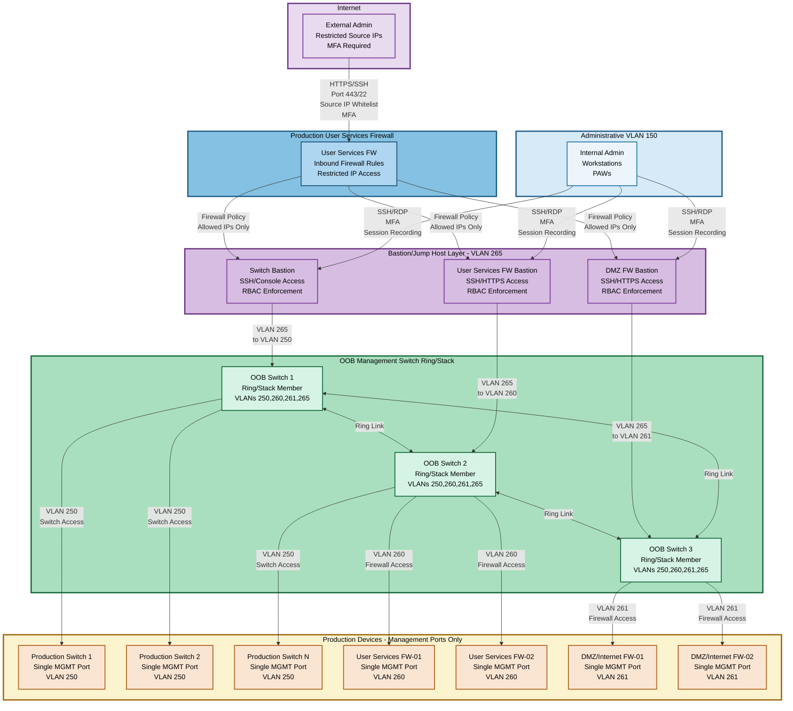

### Physical Connectivity

**Production Device Connections:**

All production network devices have a **single management port** that connects to the OOB network:

**Production Switches:**
- Management port (typically labeled "MGMT" or "Console/Mgmt")
- Connects to OOB switch access port configured for VLAN 250
- IP address in 192.168.250.0/24 subnet
- Examples: 192.168.250.10 (HQ-SW-AC-01), 192.168.250.11 (HQ-SW-AC-02)

**User Services Firewalls:**
- Dedicated management port (separate from data interfaces)
- Connects to OOB switch access port configured for VLAN 260
- IP address in 192.168.260.0/28 subnet
- Examples: 192.168.260.1 (HQ-FW-US-01), 192.168.260.2 (HQ-FW-US-02)

**DMZ/Internet Firewalls:**
- Dedicated management port (separate from data and User Services FW)
- Connects to OOB switch access port configured for VLAN 261
- IP address in 192.168.261.0/28 subnet
- Examples: 192.168.261.1 (HQ-FW-DZ-01), 192.168.261.2 (HQ-FW-DZ-02)

**Bastion/Jump Hosts:**
- Management interface connects to OOB switch
- Assigned to VLAN 265
- IP address in 192.168.265.0/28 subnet
- Examples: 192.168.265.10 (HQ-BASTION-SW-01), 192.168.265.11 (HQ-BASTION-FW-01)

### OOB Network Access Paths

**Path 1: Internal Admin Access (Primary)**

```
Internal Admin Workstation (VLAN 150)
         ↓
  SSH/RDP with MFA
         ↓
Bastion Host (VLAN 265)
         ↓
  RBAC Policy Check
         ↓
  OOB Switch performs inter-VLAN routing (VLAN 265 → VLAN 250/260/261)
         ↓
Production Device Management Interface
```

**Access Flow:**
1. Admin authenticates to bastion host from VLAN 150 (MFA required)
2. Bastion validates user credentials and RBAC permissions
3. Admin selects target device from permitted inventory
4. Bastion initiates SSH/HTTPS session to target device
5. OOB switch routes between VLAN 265 (bastion) and VLAN 250/260/261 (devices)
6. All commands logged and session recorded
7. Session terminates, audit logs sent to SIEM

**Path 2: External Admin Access (Emergency/Remote)**

```
External Admin (Internet)
         ↓
  HTTPS/SSH to exposed bastion endpoint
         ↓
Production User Services Firewall (inbound rule)
         ↓
  Source IP whitelist check
  MFA authentication
         ↓
Bastion Host (VLAN 265)
         ↓
  [Same as Path 1 from here]
```

**External Access Restrictions:**
- Production User Services Firewall has **specific inbound rule** permitting external access to bastion
- Source IP whitelist: Only specific public IPs allowed (VPN concentrator, SOC, approved admin IPs)
- Ports: TCP 443 (HTTPS) and TCP 22 (SSH) only
- MFA mandatory: Cannot bypass even with correct credentials
- Rate limiting: 10 connection attempts per minute per source IP
- Geo-blocking: Optional restriction to specific countries
- Temporary access: Rules can have time-based activation (e.g., only during maintenance windows)

**Example Firewall Rule:**
```
Rule: EXTERNAL-ADMIN-TO-BASTION
Source: 203.0.113.0/24 (Corporate VPN), 198.51.100.5/32 (SOC), 192.0.2.10/32 (Admin Home)
Destination: 10.1.265.10 (HQ-BASTION-SW-01)
Ports: TCP 443, TCP 22
Action: Permit
Logging: Full (source, destination, timestamp, session duration)
MFA: Required
Rate Limit: 10 conn/min
```

### Bastion Host Architecture

**Bastion Host Roles:**

The bastion layer provides three specialized jump hosts, each dedicated to a device type:

**Switch Bastion (HQ-BASTION-SW-01):**
- Access to: Production switches only (VLAN 250)
- Protocols: SSH (CLI), HTTPS (web GUI if enabled)
- RBAC: Network Admin, NOC Operator (read-only)
- Features: Session recording, command logging, config diff tracking

**User Services Firewall Bastion (HQ-BASTION-FW-US-01):**
- Access to: User Services firewall pairs only (VLAN 260)
- Protocols: SSH, HTTPS
- RBAC: Security Admin, Network Admin
- Features: Session recording, policy change logging, config backup

**DMZ/Internet Firewall Bastion (HQ-BASTION-FW-DMZ-01):**
- Access to: DMZ/Internet firewall pairs only (VLAN 261)
- Protocols: SSH, HTTPS
- RBAC: Security Admin, Network Admin, Limited NOC (read-only)
- Features: Session recording, VPN config tracking, internet policy logging

**Why Separate Bastions:**
1. **Security isolation:** Compromised switch bastion cannot access firewalls
2. **RBAC granularity:** Junior admins access switch bastion only, not firewalls
3. **Audit segregation:** Switch changes audited separately from firewall policy changes
4. **Compliance:** Financial regulations may require separate access controls for security devices

### OOB Switch Inter-VLAN Routing

**Routing Configuration:**

The OOB switches perform **limited inter-VLAN routing** to enable bastion-to-device communication:

**Permitted Routes:**
```
VLAN 265 (Bastion) → VLAN 250 (Switches): Permitted
VLAN 265 (Bastion) → VLAN 260 (User FW): Permitted
VLAN 265 (Bastion) → VLAN 261 (DMZ FW): Permitted

VLAN 250 → VLAN 260: DENIED (switches cannot access firewalls)
VLAN 250 → VLAN 261: DENIED (switches cannot access firewalls)
VLAN 260 → VLAN 261: DENIED (User FW cannot access DMZ FW mgmt)
All VLANs → Production Network: DENIED (OOB completely isolated)
```

**Implementation:** Use ACLs or firewall rules on OOB switches to enforce routing restrictions.

**Default Gateway Configuration:**
- Devices in VLAN 250/260/261: Default gateway points to OOB switch VLAN interface
- OOB switch does NOT provide default route (no internet access from OOB)
- Management devices isolated from production and internet

### Bastion RBAC and Access Control

**Role-Based Access Control Matrix:**

| Role | Switch Bastion | User FW Bastion | DMZ FW Bastion | Access Level |
|------|----------------|-----------------|----------------|--------------|
| **Network Administrator** | ✓ Full | ✓ Full | ✓ Full | Read/Write all devices |
| **Security Administrator** | ✓ Read-only | ✓ Full | ✓ Full | Firewall focus, switch monitoring |
| **NOC Operator** | ✓ Read-only | ✓ Read-only | ✓ Read-only | Monitoring and troubleshooting only |
| **Junior Network Engineer** | ✓ Limited Write | ✗ No access | ✗ No access | Switch config under supervision |
| **Break-Glass Admin** | ✓ Full | ✓ Full | ✓ Full | Emergency super-user (credentials vaulted) |

**RBAC Enforcement Mechanism:**

Bastion hosts use **LDAP/Active Directory integration** for authentication and authorization:

1. **Authentication:** User credentials validated against enterprise AD
2. **Group Membership:** AD groups determine role (e.g., "Network-Admins", "Security-Admins")
3. **Authorization:** Bastion maps AD groups to permitted devices and access levels
4. **Session Setup:** Bastion presents only devices user is authorized to access
5. **Command Filtering:** For read-only roles, bastion blocks write commands (config changes)

**Example User Experience:**
```
[admin@bastion-sw ~]$ ssh admin@bastion-sw-01
Password: ********
MFA Token: 123456

Welcome to HQ Switch Bastion
User: john.doe@example.com
Role: Network Administrator
Permitted devices: 45 switches

Select device:
1. HQ-SW-AC-B1-F1-01 (192.168.250.10)
2. HQ-SW-AC-B1-F2-01 (192.168.250.11)
...

Selection: 1
Connecting to HQ-SW-AC-B1-F1-01...
Session will be recorded for audit.

HQ-SW-AC-B1-F1-01#
```

### Access Workflow and Session Lifecycle

**Standard Access Workflow:**

1. **Initiation:**
   - Admin connects to bastion (internal VLAN 150 or external via firewall)
   - Provides username/password + MFA token
   
2. **Authentication:**
   - Bastion validates credentials against AD
   - MFA token verified (TOTP or hardware token)
   - Failed attempts logged, account locked after 3 failures

3. **Authorization:**
   - Bastion retrieves user's AD group memberships
   - Determines accessible devices based on RBAC matrix
   - Presents device selection menu (only permitted devices shown)

4. **Session Establishment:**
   - Admin selects target device
   - Bastion initiates SSH/HTTPS session to device management IP
   - Session recording begins (keystroke logging + screen capture)

5. **Interactive Management:**
   - Admin performs configuration or troubleshooting
   - All commands logged in real-time
   - Read-only users: Write commands blocked by bastion

6. **Session Termination:**
   - Admin exits session or idle timeout (30 minutes)
   - Session recording finalized
   - Logs transmitted to SIEM
   - Configuration changes trigger diff generation

7. **Audit and Compliance:**
   - All sessions archived for 7 years (compliance requirement)
   - Configuration changes trigger change management tickets
   - Suspicious activity (rapid config changes, access to unauthorized devices) triggers alerts

### Security Features and Hardening

**Bastion Host Security:**

- **Operating System:** Hardened Linux (minimal packages, security patches automated)
- **SSH Configuration:**
  - Public key authentication required (passwords disabled after MFA)
  - Root login disabled
  - TCP forwarding disabled (prevents tunneling)
  - X11 forwarding disabled
- **Network Isolation:**
  - No internet access from bastion (cannot download tools)
  - Cannot initiate connections to production VLANs
  - Only OOB management VLANs reachable
- **Session Recording:**
  - All sessions recorded using `script` command or dedicated tools (Teleport, Bastion)
  - Recordings tamper-proof (write-once storage)
- **Rate Limiting:**
  - Maximum 5 concurrent sessions per user
  - Maximum 10 new sessions per hour per user
- **Anomaly Detection:**
  - Unusual login times flagged (e.g., 2 AM access from NOC operator)
  - Rapid device hopping flagged (accessing 20+ devices in 5 minutes)
  - Repeated failed authentications trigger account lock + alert

**OOB Switch Security:**

- **Management Access:**
  - OOB switches themselves managed via console cable only (no in-band management)
  - Requires physical access to data center
- **VLAN ACLs:**
  - Deny inter-VLAN routing except bastion-to-devices
  - Deny all traffic to production network
- **Port Security:**
  - MAC address limiting (1-2 MACs per port)
  - BPDU Guard enabled (prevents rogue switches)
- **Monitoring:**
  - SNMP monitoring for OOB switch health
  - Syslog forwarding to SIEM

### IP Addressing and Subnetting

**OOB Management Subnets:**

| VLAN | Subnet | Usable IPs | Purpose |
|------|--------|------------|---------|
| 250 | 192.168.250.0/24 | .1-.254 | Production switch management (up to 254 switches) |
| 260 | 192.168.260.0/28 | .1-.14 | User Services firewall management (up to 14 devices) |
| 261 | 192.168.261.0/28 | .1-.14 | DMZ/Internet firewall management (up to 14 devices) |
| 265 | 192.168.265.0/28 | .1-.14 | Bastion hosts (up to 14 bastions) |

**Default Gateways:**
- VLAN 250: 192.168.250.254 (OOB switch VLAN interface)
- VLAN 260: 192.168.260.254 (OOB switch VLAN interface)
- VLAN 261: 192.168.261.254 (OOB switch VLAN interface)
- VLAN 265: 192.168.265.254 (OOB switch VLAN interface)

**DNS for OOB Network:**
- Internal DNS server in DMZ (VLAN 200) NOT used by OOB (isolation requirement)
- Option 1: Bastion hosts maintain local /etc/hosts file with device hostnames
- Option 2: Dedicated DNS server on OOB network (VLAN 265) with only management hostnames
- **Recommended:** Local hosts file for critical devices, DNS for scalability

### Monitoring and Alerting

**OOB Network Health Monitoring:**

- **OOB Switch Monitoring:**
  - SNMP polling every 60 seconds (interface status, CPU, memory)
  - Syslog collection (config changes, port status changes)
  - Ring/stack integrity monitoring (link failures generate critical alerts)

- **Bastion Host Monitoring:**
  - Service availability (SSH daemon uptime)
  - Authentication failures (trigger alert after 5 failures in 5 minutes)
  - Session count (alert if > 50 concurrent sessions - possible attack)
  - Disk space (session recordings consume storage)

- **Managed Device Availability:**
  - ICMP ping from bastion to all managed devices every 5 minutes
  - Device unreachability triggers alert (possible device failure or OOB connectivity issue)

**Security Event Monitoring:**

- **Failed Authentication Attempts:**
  - 3 failures: Log event
  - 5 failures: Lock account + alert security team
  - 10 failures across multiple accounts: Alert on potential brute force attack

- **Unusual Access Patterns:**
  - Access from new source IP (external admin): Alert security team
  - Access during unusual hours (2 AM - 6 AM): Alert security team
  - Rapid device hopping (> 10 devices in < 5 minutes): Alert + flag for review

- **Configuration Changes:**
  - Any config change on firewall: Generate diff, create change ticket, alert security team
  - Config change outside maintenance window: High-priority alert
  - Unauthorized config change (from non-admin account): Critical alert

### Operational Procedures

**Adding New Managed Device:**

1. Cable management port of new device to OOB switch
2. Configure OOB switch access port:
   - Assign to appropriate VLAN (250 for switch, 260/261 for firewall)
   - Enable port security (max 1 MAC)
   - Enable BPDU Guard
3. Configure device management interface:
   - Static IP in appropriate subnet
   - Default gateway to OOB switch VLAN interface
   - Enable SSH/HTTPS management
4. Update bastion device inventory (add device hostname, IP, type)
5. Test connectivity from bastion to new device
6. Update documentation and CMDB

**Break-Glass Emergency Access:**

For emergencies when bastion hosts unavailable:

1. **Physical Console Access:**
   - Data center technician connects laptop to device console port
   - Serial console cable provides out-of-band access
   - Requires physical presence in data center (security control)

2. **Break-Glass Credentials:**
   - Emergency super-user credentials stored in password vault
   - Requires two-person authorization to retrieve
   - Credentials rotated after each use
   - All break-glass access logged and audited

**Maintenance and Patching:**

- **Bastion Hosts:**
  - Monthly security patches during maintenance window
  - Bastion hosts patched sequentially (maintain 1 available during patching)
  - Full backup before patching

- **OOB Switches:**
  - Firmware updates annually or for critical security patches
  - Ring/stack design allows one switch patched at a time (no downtime)
  - Backup configuration before firmware update

### Design Rationale Summary

**Why This Architecture:**

1. **Single Management Port Reality:**
   - Most devices have only one management port
   - Cannot dual-home management to redundant switches like production interfaces
   - Ring/stack topology provides redundancy without requiring dual management ports

2. **VLAN Segmentation for Security:**
   - Compromised switch cannot access firewall management interfaces
   - Lateral movement prevented by Layer 2 isolation

3. **Bastion Enforcement Point:**
   - All access mediated through bastion (no direct admin-to-device access)
   - RBAC enforced at single point
   - Session recording guaranteed for audit and compliance

4. **External Access Controlled:**
   - Production firewall enforces strict inbound rules
   - Source IP whitelist prevents unauthorized external access
   - MFA mandatory for all external connections

5. **Operational Flexibility:**
   - Internal admins access directly from VLAN 150 (faster than VPN)
   - External admins access via internet when off-site
   - Both paths converge at bastion for consistent RBAC and logging

---

## Naming Conventions

### VLAN Naming Standards

**Format:** `<SITE>-<FUNCTION>-<POPULATION/SERVICE>`

**Examples:**

| VLAN ID | VLAN Name | Description |
|---------|-----------|-------------|
| 100 | HQ-USER-CORP | Corporate Users at HQ |
| 110 | HQ-VOICE-IP | Voice Devices at HQ |
| 120 | HQ-USER-BMS | Building Management at HQ |
| 130 | HQ-USER-VIDEO | Video Collaboration at HQ |
| 140 | HQ-USER-GUEST | Guest Access at HQ |
| 150 | HQ-USER-ADMIN | Admin Systems at HQ |
| 160 | HQ-USER-OT | Operational Technology at HQ |
| 200 | HQ-DMZ-DNS | DNS DMZ at HQ |
| 210 | HQ-DMZ-AD | Active Directory DMZ at HQ |
| 220 | HQ-DMZ-FILE | File Services DMZ at HQ |
| 230 | HQ-DMZ-COLLAB | Collaboration DMZ at HQ |
| 240 | HQ-DMZ-PBX | PBX DMZ at HQ |
| 250 | HQ-MGMT-SW-OOB | Switch OOB at HQ |
| 260 | HQ-MGMT-FW-OOB | Firewall OOB at HQ |
| 270 | HQ-DMZ-PUB | Publishing DMZ at HQ |

**Multi-Site Consistency:**
- VLAN IDs consistent across all sites (VLAN 100 always Corporate)
- VLAN names include site identifier (NYC-USER-CORP, LON-USER-CORP)

### Subnet Identification

**Format:** `<SITE>-<POPULATION/SERVICE>-NET`

**Examples:**

| Subnet Name | VLAN | RFC1918 Space | Typical Size |
|-------------|------|---------------|--------------|
| HQ-CORP-NET | 100 | 10.0.0.0/8 | /22 (large), /24 (small) |
| HQ-VOICE-NET | 110 | 10.0.0.0/8 | /23 (large), /25 (small) |
| HQ-BMS-NET | 120 | 10.0.0.0/8 | /24 (large), /26 (small) |
| HQ-VIDEO-NET | 130 | 10.0.0.0/8 | /25 (large), /27 (small) |
| HQ-GUEST-NET | 140 | 172.16.0.0/12 | /23 (large), /24 (small) |
| HQ-ADMIN-NET | 150 | 10.0.0.0/8 | /26 (large), /27 (small) |
| HQ-OT-NET | 160 | 192.168.0.0/16 | /22 (large), /25 (small) |
| HQ-DNS-DMZ-NET | 200 | 10.0.0.0/8 | /28 |
| HQ-SWOOB-NET | 250 | 192.168.0.0/16 | /24 (large), /26 (small) |

**RFC1918 Allocation:**
- 10.0.0.0/8: Primary for users and DMZs
- 172.16.0.0/12: Guest networks
- 192.168.0.0/16: Management and OT

### Device Hostname Conventions

**Format:** `<SITE>-<DEVICE_TYPE>-<FUNCTION>-<NUMBER>`

**Access Switches (Large Sites):**
- Format: `<SITE>-SW-AC-<BUILDING>-<FLOOR>-<NUMBER>`
- Examples:
  - HQ-SW-AC-B1-F2-01 (HQ, Building 1, Floor 2, Access Switch 1)
  - NYC-SW-AC-B3-F1-01 (NYC, Building 3, Floor 1, Access Switch 1)

**Aggregation Switches (Large Sites):**
- Format: `<SITE>-SW-AG-<NUMBER>`
- Examples:
  - HQ-SW-AG-01
  - NYC-SW-AG-02

**Access/Aggregation Switches (Small Sites):**
- Format: `<SITE>-SW-ACAG-<NUMBER>`
- Examples:
  - CHI-SW-ACAG-01 (Stack Member 1)
  - CHI-SW-ACAG-02 (Stack Member 2)

**OOB Switches:**
- Format: `<SITE>-SW-OOB-<NUMBER>`
- Examples:
  - HQ-SW-OOB-01
  - HQ-SW-OOB-02

**Firewalls:**

User Services:
- Format: `<SITE>-FW-US-<NUMBER>`
- Examples:
  - HQ-FW-US-01 (Active)
  - HQ-FW-US-02 (Active or Passive)

DMZ/Internet:
- Format: `<SITE>-FW-DZ-<NUMBER>`
- Examples:
  - HQ-FW-DZ-01 (Active)
  - HQ-FW-DZ-02 (Active or Passive)

**Jump Hosts:**
- Switch Management: `<SITE>-JH-SW-<NUMBER>` (e.g., HQ-JH-SW-01)
- Firewall Management: `<SITE>-JH-FW-<NUMBER>` (e.g., HQ-JH-FW-01)

**DNS Naming:**
- Forward: hq-sw-ac-b1-f2-01.corp.example.com
- Virtual IPs: hq-fw-us.corp.example.com (cluster VIP)

---

## Scalability and Growth Considerations

**New Site Addition:**
- Implement site-appropriate architecture (3-tier or 2-tier)
- Configure standard VLANs with site-specific naming
- Establish VPN tunnels to hub(s)
- Configure routing to advertise site networks
- Update firewall policies
- 2-4 weeks for small site, 4-8 weeks for large site

**New Population Addition:**
- Assign new VLAN ID
- Create VLAN on all switches at all sites
- Configure gateway subnet on firewalls
- Create firewall policies
- Configure QoS policies
- 1-2 weeks implementation

**New DMZ Service:**
- Assign DMZ VLAN ID
- Create VLAN on aggregation/stack switches
- Configure DMZ subnet on DMZ/Internet firewall
- Create access policies
- Deploy application servers
- 2-4 weeks implementation

**Capacity Expansion:**

Access Layer:
- Add switches as needed, minimal impact
- Dual-home to aggregation layer

Aggregation Layer:
- Uplink speed increase or switch replacement
- Incremental migration with change windows

Firewall Capacity:
- Deploy new pair in parallel at 60-70% utilization
- Migrate traffic through routing changes
- Minimizes risk

VPN Hub Scaling:
- Size for max spokes plus 50% growth
- Deploy additional hub if exceeded
- Hub-to-hub VPN for spoke-to-spoke across hubs

**Technology Refresh:**

Hardware Lifecycle:
- Access/Aggregation switches: 5-7 years
- Firewalls: 3-5 years
- OOB infrastructure: 7-10 years

Software Lifecycle:
- Switch firmware: Annually or as patches released
- Firewall firmware: Quarterly or as patches released
- Major version upgrades: Every 2-3 years with lab testing

Budget: 15-20% annual refresh, prioritize firewalls and aggregation.

**Future Architecture Evolution:**

- **SD-WAN:** Compatible with current IPsec VPN architecture
- **Cloud Integration:** VPN tunnels extend to AWS/Azure as spokes
- **Zero Trust:** Current segmentation foundation for Zero Trust micro-segmentation
- **Wireless:** Integrates with aggregation layer, uses existing population VLANs

---

## Appendix A: Network Diagrams

### Overall Logical Topology

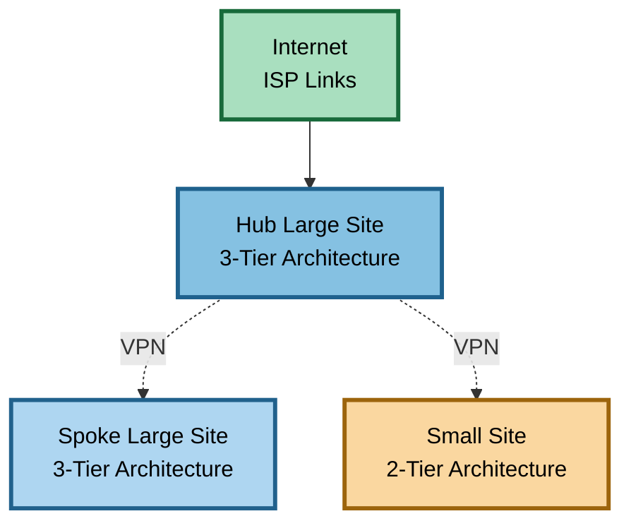

### Large Site Detailed Topology

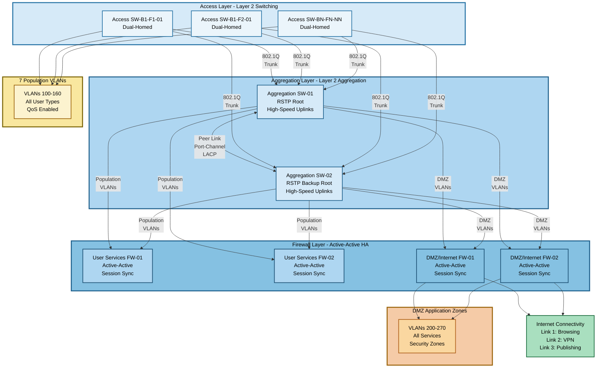

### Small Site Detailed Topology

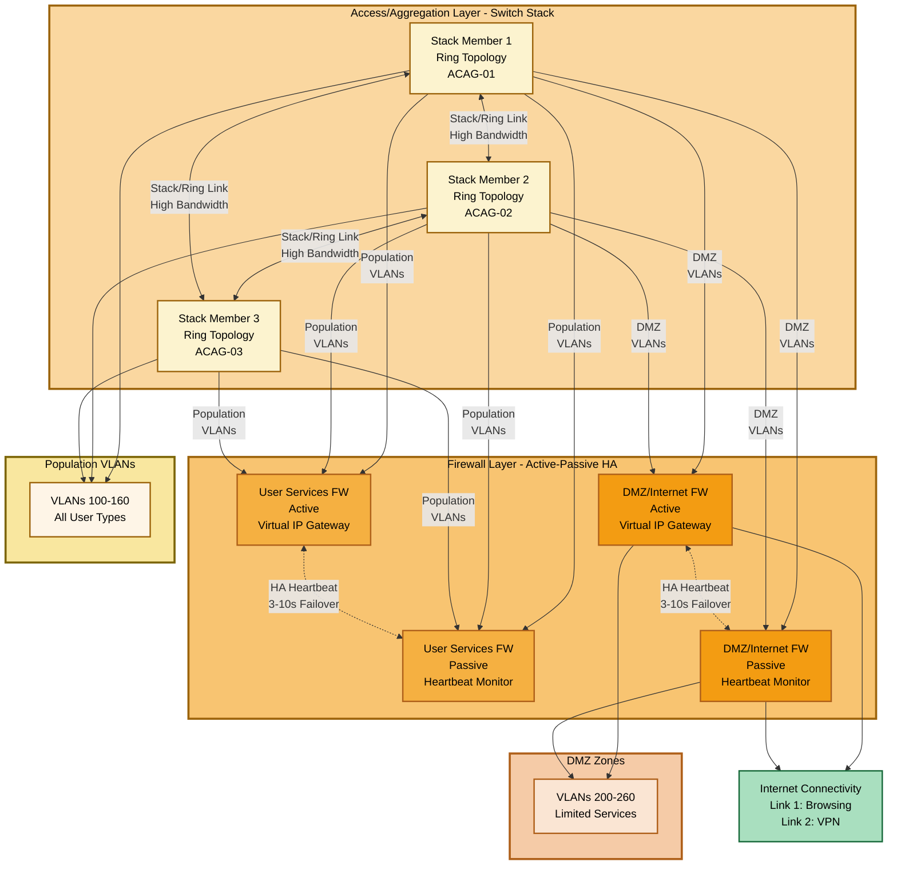

### VLAN and Population Mapping

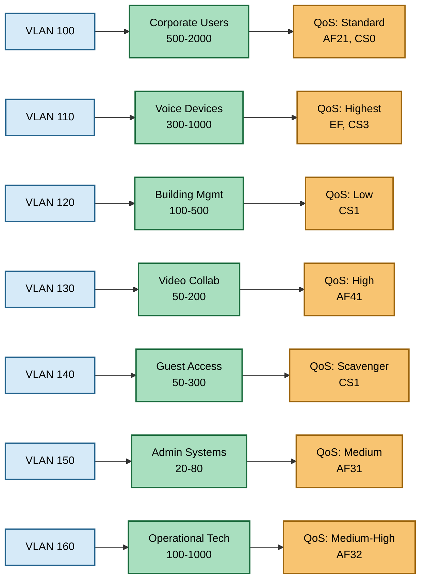

---

## Appendix B: Reference Tables

### Population Summary Table

| Population | VLAN | Large Site Count | Small Site Count | QoS Priority | DSCP | Bandwidth |
|------------|------|------------------|------------------|--------------|------|-----------|
| Corporate Users | 100 | 500-2000 | 50-400 | Standard | AF21, CS0 | 2-5 Mbps |
| Voice Devices | 110 | 300-1000 | 40-300 | Highest | EF, CS3 | 64-128 Kbps |
| Building Mgmt | 120 | 100-500 | 30-150 | Low | CS1 | 0.5-2 Mbps |
| Video Collab | 130 | 50-200 | 10-50 | High | AF41 | 2-8 Mbps |
| Guest Access | 140 | 50-300 | 10-100 | Scavenger | CS1 | 5-10 Mbps |
| Admin Systems | 150 | 20-80 | 5-20 | Medium | AF31 | 1-5 Mbps |
| Operational Tech | 160 | 100-1000 | 20-200 | Med-High | AF32, EF | 0.1-0.5 Mbps |

### DMZ Summary Table

| DMZ Zone | VLAN | Purpose | Access From | Device Count |
|----------|------|---------|-------------|--------------|
| DNS | 200 | Name resolution | All Populations | 2-4 |
| Active Directory | 210 | Authentication | Corporate, Admin | 2-8 |
| File Services | 220 | Shared storage | Corporate, Admin | 2-10 |
| Collaboration | 230 | Video conferencing | Corp, Video, Admin | 2-6 |
| PBX | 240 | IP telephony | Voice, Admin | 2-4 |
| Switch OOB | 250 | Switch management | Admin only | All switches + jump hosts |
| Firewall OOB | 260 | Firewall management | Admin only | All firewalls + jump hosts |
| Publishing | 270 | Public services | Internet | 4-20 (large sites only) |

### Site Comparison Table

| Feature | Large Site | Small Site |
|---------|-----------|------------|
| Architecture | Three-tier | Two-tier collapsed |
| User Population | 500+ | 50-500 |
| Firewall HA | Active-active | Active-passive |
| Internet Links | 3 (browse, VPN, publish) | 2 (browse, VPN) |
| Publishing DMZ | Yes | No |
| VPN Role | Hub or spoke | Spoke only |
| Failover Time | <1 second | 3-10 seconds |
| Deployment Cost | Higher | Lower |

### QoS Queue Configuration (8-Queue Model)

| Queue | Priority | DSCP | Traffic | Scheduling | Bandwidth % |
|-------|----------|------|---------|------------|-------------|
| 8 | Highest | EF (46) | Voice RTP | Strict Priority | 15% |
| 7 | High | AF41 (34) | Video media | Strict Priority | 25% |
| 6 | Med-High | CS3 (24) | Voice signaling | WFQ | 5% |
| 5 | Medium | AF32 (28) | OT critical | WFQ | 10% |
| 4 | Medium | AF31 (26) | Admin | WFQ | 10% |
| 3 | Standard | AF21 (18) | Business apps | WFQ | 20% |
| 2 | Standard | CS0 (0) | General | WFQ | 10% |
| 1 | Lowest | CS1 (8) | BMS, Guest | WFQ | 5% |

### Internet Link Summary

| Link | Purpose | Small Site BW | Large Site BW | Traffic |
|------|---------|---------------|---------------|---------|
| Link 1 | User Browsing | 100M-1G | 500M-10G | HTTP/HTTPS, SaaS |
| Link 2 | IPsec VPN | 50M-500M | 1G-10G | Site-to-site encrypted |
| Link 3 | Publishing | N/A | 100M-1G | Public services |

### VPN Tunnel Parameters

| Parameter | Value | Notes |
|-----------|-------|-------|
| Protocol | IPsec IKEv2 | IKEv1 compatible |
| Phase 1 Encryption | AES-256 | AES-128 for performance |
| Phase 1 Integrity | SHA-256 | SHA-384 for higher security |
| Phase 1 DH Group | Group 19 (ECC) | Group 14 minimum |
| Phase 1 Lifetime | 28,800 sec | 8 hours |
| Phase 2 Encryption | AES-256-GCM | Encryption + integrity |
| Phase 2 PFS | Enabled | Group 19 or 14 |
| Phase 2 Lifetime | 3,600 sec | 1 hour |
| DPD Interval | 10 seconds | 3 retries |
| NAT-Traversal | Enabled | UDP 4500 |

### Management Protocol Summary

| Protocol | TCP/UDP | Port | Purpose | Security |
|----------|---------|------|---------|----------|
| SSH | TCP | 22 | CLI management | Encrypted (preferred) |
| HTTPS | TCP | 443 | Web management | Encrypted |
| SNMP | UDP | 161 | Monitoring | SNMPv3 with auth |
| Syslog | UDP/TCP | 514/6514 | Logging | TCP with TLS preferred |
| NTP | UDP | 123 | Time sync | Auth recommended |
| TACACS+ | TCP | 49 | AAA | Encrypted |

---

## Document Revision History

| Version | Date | Author | Changes |
|---------|------|--------|---------|
| 1.0 | December 2025 | Network Architecture Team | Initial HLD release |

---

## Approval Signatures

| Role | Name | Signature | Date |
|------|------|-----------|------|
| Network Architect | ___________________ | ___________________ | __________ |
| Security Architect | ___________________ | ___________________ | __________ |
| IT Director | ___________________ | ___________________ | __________ |

---

**END OF DOCUMENT**
